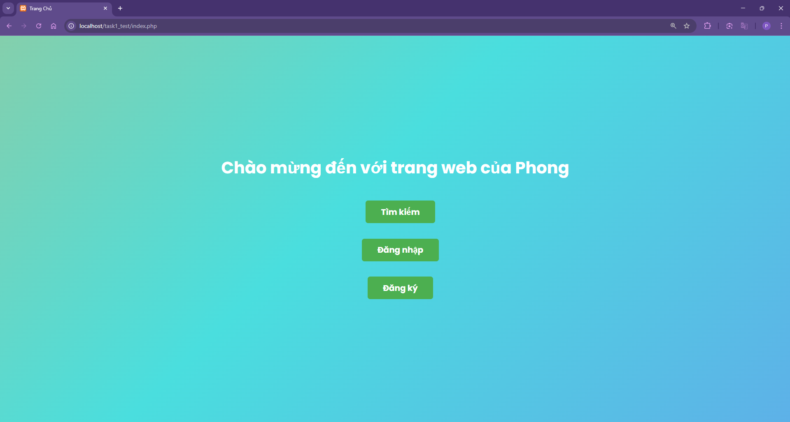

# Task 1

Text: - Dev 1 trang web có chức năng cơ bản là đăng ký, đăng nhập, hiển thị thông tin tài khoản (tên, giới tính, email, địa chỉ, sdt), search người dùng
- Phần client thì không cần quá đẹp
- Phần server thì chọn ngôn ngữ PHP và database MySQL

# Task 1

# I. DEMO WEB

1. Trang chủ 

1. Trang đăng nhập 

sau khi đăng nhập thì hiện thông tin cá nhân 

1. Trang đăng ký

1. Trang tìm kiếm 

kết quả tìm kiếm 

1. Cơ sở dữ liệu 

II. Quy trình tạo trang web

Bước 1: Tạo database và bảng users trong XAMPP. Cơ sở dữ liệu này bao gồm id( khóa chính), name, gender, email, address, phone, password.

Bước 2: Tạo file trang chủ index.php và file connect.php để kết nối với database

Bước 3: Tạo file register.php để người dùng tạo tài khoản

Bước 4: Tạo file login.php để người dùng đăng nhập, tạo file logout.php để gắn vào trang đăng nhập để đăng xuất

Bước 5: Tạo file search.php để người dùng tìm kiếm thông tin user

Bước 6: Tạo file style.css để thêm css rồi nhúng css vào các 

Cấu trúc thư mục

htdocs/
└── Task1/
    ├── index.php             ← Trang chủ
    ├── login.php             ← Trang đăng nhập 
    ├── register.php         ← Trang đăng ký
    ├── profile.php           ← xem thông tin người dùng
    ├── search.php           ← Trang tìm kiếm
    ├── logout.php           ← Đăng xuất để hủy session
    ├── connect.php         ← Kết nối db 
    └── style.css                ← style

# III. Source code

1. index.php
    
    [index.php](index.php)
    

Chức năng: truy cập trang tìm kiếm, đăng nhâp, đăng ký

1. connect.php
    
    [connect.php](connect.php)
    

Kết nối giữa php và database

1. register.php
    
    [register.php](register.php)
    

Chức năng: cung cấp giao diện đăng ký

Cho phép người dùng chuyển hướng đến trang chủ

1. login.php
    
    [login.php](login.php)
    

Chức năng: cung cấp giao diện đăng nhập, đăng nhập xong sẽ hiện thông tin cá nhân, cho phép quay về trang chủ

1. profile.php
    
    [profile.php](profile.php)
    

Chức năng: hiển thị thông tin các nhân khi người dùng đăng nhập xong

1. logout.php
    
    [logout.php](logout.php)
    

Xử lý đăng xuất, xóa phiên làm việc hiện tại

1. search.php

Chức năng: cung cấp giao diện tìm kiếm, cho phép quay về trang chủ

[search.php](search.php)

1. style.css
    
    [style.css](style.css)
    

css để tạo giao diện 

III. Ưu điểm và hạn chế

1. Ưu điểm
    1. Có mã hóa mật khẩu 
    2. Sử dụng Prepared Statement tạo câu lệnh chuẩn bị $stmt = $conn->prepare("SELECT * FROM users WHERE email = ?"); 
    
    để tránh bị SQLi
    
2. Hạn chế
    
    Chỉ xem được thông tin cá nhân khi đăng nhập
    
    Còn nhiều lỗ hổng
    
    Css hoàn toàn do AI tạo